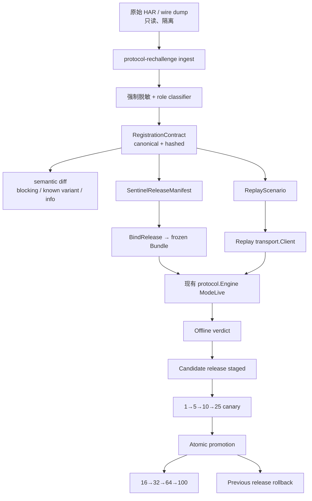

# 最新 HAR 协议重新挑战与持续漂移治理开发计划

> 状态：待实施的开发与验收合同  
> 日期：2026-07-24  
> 范围：`go-email-protocol` 邮箱注册主链、Sentinel、Header/TLS、fixture/replay、canary、100 并发重新放量  
> 证据：三份原始 HAR、当前源码、现有计划、并行源码审计  
> 案例状态：`cases/2026-07-24-har-rechallenge/assessment.state.json`  
> 历史计划：[`TRUE_100_CONCURRENCY_FINGERPRINT_PLAN.md`](TRUE_100_CONCURRENCY_FINGERPRINT_PLAN.md)、[`PURE_GO_FULL_FINGERPRINT_PLAN.md`](PURE_GO_FULL_FINGERPRINT_PLAN.md)、[`EMAIL_PROTOCOL_GO_PLAN.md`](EMAIL_PROTOCOL_GO_PLAN.md)

---

## 0. 结论：可以重新挑战，但不能再靠“改一个字段”

我的判断：**可以做，而且成功概率比一次性追字段高。**

但当前代码还不能诚实地宣称“按 2026-07-24 HAR 完整对齐并可稳定重新挑战”。原因不是 SDK build 已经更换，而是以下几类问题叠加：

1. HAR 的动态字段、运行时脚本来源、SDK 内容身份被混在一起；
2. fixture 是单状态形状表，不是多 capture 的 wire contract；
3. 所谓 fixture mode 不执行真实请求构造，也不验证 Cookie/redirect；
4. 当前 HeaderPreset、fixture 元数据与 d17/d24 真实请求存在可验证的不一致；
5. Sentinel SDK 内容 pin 正确，但 `scriptSources` 只默认一个 URL，遗漏 loader/source 集合；
6. S11 的 `openai-sentinel-so-token` 在 HAR 中稳定存在，但当前 SO 失败可被静默省略；
7. 传输层仍存在 `capture_required` profile、Firefox major 不严校验、恢复时 profile 绑定过晚等问题；
8. 当前运行配置、README、历史进度表、admission 默认值互相矛盾；
9. 单会话 wire correctness 尚未形成机器门禁，却已允许 Go / TLS / 100 seat 组合运行。

因此这次不做“d24 URL 热修”。终态应是：

```text
HAR / wire dump
  → 只读导入 + 强制脱敏
  → 规范化 RegistrationContract
  → 语义 diff（阻断 / 已知变体 / 信息）
  → Sentinel release manifest
  → 离线真实 FSM replay
  → Transport/Header/Session 门禁
  → 小流量重新挑战
  → 原子 promotion / rollback
  → 16 → 32 → 64 → 100 放量
```

---

## 1. 原始证据与角色

### 1.1 HAR 身份

| ID | 文件 | SHA-256 | 角色 |
|---|---|---|---|
| H17 | `chatgpt.com_Archive [26-07-17 16-27-15].har` | `4f8307893c302d3e6d8709e42b140ea3078334bffe7e75e3e91e2782b887259e` | 注册主链；Firefox 150；pt-BR；当前 Sentinel case-001 来源 |
| H18 | `chatgpt.com_Archive [26-07-18 08-45-17].har` | `3395a431597cc5f505483bf06bec378fdca6705fba50586dad14aae4dc390cd9` | 已登录 Plus/Stripe checkout；`checkout_session_approval`；**不得作为注册基线** |
| H24 | `chatgpt.com_Archive [26-07-24 05-18-35].har` | `fcff279e35969a3ccf8bf14710fbc0c54e9600796f57cffe345fa7ba918b9a97` | 最新成功注册主链；Firefox 150；ja/ja-JP；`create_account` 200 |

原始 HAR 保持只读，不复制进仓库，不在测试 fixture 中保存原始 token、Cookie、OTP、邮箱、OAuth code、state、CSRF、代理或 capability。

### 1.2 纠正后的 Sentinel 结论

今天 `p[5]` 从 versioned SDK URL 变成 backend-api URL，**不是 SDK build/content 漂移**。

| 资产 | d17 | d24 | 结论 |
|---|---|---|---|
| loader URL | `https://sentinel.openai.com/backend-api/sentinel/sdk.js` | 同左 | 两份 HAR 都请求过 |
| loader 长度 | 923 bytes | 923 bytes | 完全一致 |
| loader SHA-256 | `a656b4b050e98ad23afc481a8d2fd7d0a316813ee38cf52bec07860e264d57cb` | 同左 | 完全一致 |
| loader 注入目标 | `/sentinel/20260219f9f6/sdk.js` | 同左 | 完全一致 |
| versioned SDK SHA-256 | `4f8ef8d5870894fd0101fc40ff45ea13c0f8e25c71c2ba28e5df5baf98babbb5` | 同左 | 与仓库 embedded pin 完全一致 |
| frame `sv` | `20260219f9f6` | `20260219f9f6` | 未变化 |
| Sentinel `p[5]` 抽样结果 | versioned URL | loader URL | DOM `scriptSources` 的随机抽样差异 |

正确模型：

```text
SDKContentIdentity
  version = 20260219f9f6
  sdk_sha256 = 4f8ef8d5...

SDKLoaderIdentity
  loader_url = .../backend-api/sentinel/sdk.js
  loader_sha256 = a656b4b0...
  resolves_to = .../sentinel/20260219f9f6/sdk.js

ObservedScriptSources
  - loader URL
  - versioned SDK URL

payload[5] = sample(ObservedScriptSources)
```

禁止做法：

- 不替换现有 embedded SDK pin；
- 不把 d24 loader URL设为唯一默认；
- 不把 URL 变化错误升级为 SDK content drift；
- 不允许未知 loader/source 在没有 hash/resolve 证据时静默通过。

### 1.3 d17 与 d24 的稳定注册合同

已确认稳定：

- Firefox 150；没有 `sec-ch-ua*`；
- `authorize` query key 集一致；
- S10 body 为 `{code}`；
- S11 body 为 `{name,birthdate}`；
- Sentinel flow 为 `oauth_create_account`；
- Sentinel requirements payload 仍为 25 项；
- S11 都携带 `openai-sentinel-token` 与 `openai-sentinel-so-token`；
- S10/S11 都观察到 `x-access-flow-invocation-id`、trace/Datadog 头；
- callback 仍回到 `chatgpt.com/api/auth/callback/openai`；
- d24 S11 返回 200，并产生可继续的 callback。

需要分类而不是硬编码：

- locale/timezone/hardwareConcurrency/随机 navigator/document/window key；
- Datadog trace ID、flow invocation ID；
- Cookie 值、OAuth code/state；
- d24 的 `oai-client-version` / build number / `x-oai-is-pending-updates`，它们主要属于登录后 ChatGPT API；
- d17 HAR 的 S11 `status=0` 是 capture/transport 结果，不得当作成功响应；d24 的 S11 200 才是成功证据。

### 1.4 Cloudflare 证据

- d17 在 `chatgpt.com` 观察到 JSD challenge；
- d24 在 `auth.openai.com` 观察到 JSD loader + oneshot POST；
- 仅凭 HAR 不能证明它是纯 Go 每次注册的必经步骤；
- 先作为 `edge_challenge_observed` 记录，后续通过 Cookie 因果分析与 canary 判断是否为硬前置。

在因果关系证明前：

- 不把 Cloudflare challenge 硬塞进 S0–S14 FSM；
- 遇到明确 challenge response 时返回 typed `edge_challenge_required`；
- 不在 S7/S10/S11 的不确定发送后自动重试 challenge 或注册 POST。

---

## 2. 旧计划保留什么，新增什么

### 2.1 `TRUE_100_CONCURRENCY_FINGERPRINT_PLAN` 仍然正确的部分

保留以下硬合同：

1. 100 是 100 个隔离会话，不是 100 个进程；
2. 每 job 独占 Bundle、proxy SID、jar、client、mailbox、seat；
3. 取消 A 不影响 B；
4. 满座进入背压，不直接记业务失败；
5. `access_token` 非空并成功落库才算业务成功；
6. 运行账本、资源账本、DB 状态必须一致；
7. 16 → 32 → 64 → 100 阶梯放量。

### 2.2 旧计划缺少的闭环

新增本文件负责：

- HAR 角色识别；
- 多 capture / 多 variant contract；
- loader → versioned SDK 关系；
- 动态字段语义分类；
- 真正执行现有 Live FSM 的离线 replay；
- redirect/Cookie jar/hop 验证；
- app/cookie-jar/transport 三类 header 来源；
- active contract / candidate contract 的 promotion 与 rollback；
- 单会话 wire gate 与 100 load gate 分离；
- runtime diagnostics 暴露实际加载的 contract/profile/pin，而不是相信文档复选框。

### 2.3 证据权威顺序

```text
1. 原始 HAR / 运行时 capture（只读）
2. 当前源码 + 可重复测试
3. 已 promotion 的 immutable contract/release manifest
4. runtime diagnostics / canary report
5. 历史计划与进度文档
```

历史文档不能覆盖源码和运行证据。

---

## 3. 当前源码审计结果

### 3.1 已具备

| 能力 | 证据 |
|---|---|
| 纯 Go S0–S14 FSM | `internal/protocol/live.go`、`live_tail.go` |
| per-job Bundle/Profile/Jar/Client/Proxy 结构 | `internal/job/runtime.go` |
| Sentinel SDK embedded hash + patch hook pin | `internal/sentinel/sdk_pin.go` |
| startup SDK hash/frame drift 检查 | `internal/sentinel/sdk_drift.go`、worker `main.go` |
| Sentinel 25 项 payload + `p[5]` 随机选 source | `internal/sentinel/pow.go` |
| Turnstile SDK/VM、SO 路径 | `internal/sentinel/turnstile_*`、`session_observer.go` |
| Firefox 不发送 Client Hints | `internal/headerpreset/preset.go` |
| fixture 脱敏校验 | `internal/fixture/redact.go` |
| S7/S10/S11 ambiguous-after-send 标记 | protocol live handlers |
| synthetic 100-job 隔离与背压测试 | `internal/api/g1_test.go` |

### 3.2 未具备或只完成一半

| 缺口 | 当前事实 | 风险 |
|---|---|---|
| HAR ingest | fixture recorder 只接受已经成型的 Fixture JSON | 人肉摘字段、容易漏 |
| 多 capture contract | `Catalogue` 只用 `StateID` 作 key，重复 state 直接报错 | d17/d24 不能同时成为基线 |
| 真 wire replay | `ModeFixture` 只线性推进；测试 `Do` hook 不验证请求 | 测试绿不代表请求正确 |
| redirect/Cookie replay | `Do` hook 绕过真实 client jar/redirect | S4/S12 会话传播未被测试 |
| Header 来源模型 | 一个 flat `HeaderKeys` 列表 | 把 transport/cookie/app 头混为一谈 |
| Fixture 与 runtime preset 绑定 | fixture 名与 `headerpreset.Name` 是两套字符串，catalogue 只查非空 | fixture 可以与真实 builder 完全不一致 |
| S3/S4 query contract | fixture 与 live builder 未由 HAR contract 校验 | authorize/session 入口可能漂移 |
| S10 contract | 旧 fixture 明确排除 `accept-language/sec-fetch`，d17/d24 实际存在；runtime 无 flow/trace/RUM | fixture 已陈旧 |
| Sentinel content-type | HAR 为 `text/plain;charset=UTF-8`；live override 可变成 JSON | 浏览器合同不一致 |
| S11 contract | HAR 稳定观察 SO、flow invocation、trace/RUM；现有 fixture/handler覆盖不全 | S11 可能因字段组合变严失败 |
| Script source release | 默认只有 versioned URL，没有 loader/source set 与 resolve 关系 | d24 entropy 无法重现 |
| SO 强制性 | 计算失败时可静默不发 SO | HAR 稳定合同被弱化 |
| Runtime error provenance | `MapRuntimeFailure` 未统一使用 `errors.As`，SO 无独立类别 | 漂移被归错类 |
| TransportProfile | profile fixture 仍 `capture_required`，hash 空 | TLS/H2/header-order 无发布门禁 |
| Firefox transport major | consistency parser 主要覆盖 Chrome/Edge；tls-client 可落到 Firefox fallback profile | UA 150 与实际 TLS profile 可能不一致 |
| Recovery transport | client 构造早于 ledger profile 解析 | 重启后恢复会话可能使用错误 profile |
| direct transport | stdlib `net/http` + SOCKS，不是浏览器 TLS profile | 不能作为 wire-correct canary |
| 启动门禁 | worker 只查 Sentinel SDK；pure-Go CLI 不共用完整 gate | CLI/worker 行为不同 |
| diagnostics | 只暴露 runner/mode/transport/seat | 看不到 contract/pin/profile/hash/漂移 |
| 并发上限 | admission 注释说 100，常量是 200；`start.py`/config 又传 100 | 独立启动结果不同 |
| 运行事实 | config/start 已默认 Go/TLS/100；README/历史计划仍写未切 | 操作员无法知道真实状态 |

### 3.3 当前测试能证明什么

能证明：

- fixture JSON 存在、能解析、脱敏规则通过；
- headerpreset 内部输出符合自身单测；
- synthetic response 下 FSM 可从 S0 走到 S14；
- FakeFactory 下 100 runtime 指针/seat/cancel 基础隔离。

不能证明：

- d17/d24 outbound request 完全匹配；
- S3/S4 query、redirect、Cookie jar 正确；
- S10/S11 protected header 合同正确；
- Sentinel loader/source 集正确；
- Firefox 150 UA 与 TLS ClientHello/H2 profile 一致；
- worker restart 后恢复仍使用原 profile/contract；
- 软件路径 100 并发无 S10/S11/OTP 串扰。

---

## 4. “重新挑战成功”的定义

### 4.1 单会话成功

一次挑战必须全部满足：

1. 使用明确的 `contract_release_id`、`sentinel_release_id`、`transport_profile_id`；
2. startup gate 全绿；
3. S0–S14 每一步匹配 contract；
4. S7/S10/S11 不发生未处理的 ambiguous replay；
5. S11 按 contract 生成 Sentinel + SO；
6. S12 callback 后 S13 获得 schema-valid session；
7. `access_token` 非空；
8. account/session document schema 校验通过；
9. 成功结果最终落入业务库；
10. 日志中无 raw token、Cookie、OTP、proxy credential。

### 4.2 离线重新挑战成功

- d17 与 d24 两个 registration scenario 都通过同一套 `ModeLive` request builder；
- 网络请求次数为 0；
- 每一步 method/host/path/query/body/header policy/redirect/cookie/response discriminator 都被 matcher 检查；
- d18 被 role gate 排除；
- d17 `p[5]=versioned` 与 d24 `p[5]=loader` 都解析到同一 Sentinel release；
- 未知 source/hash/build/hook 必须失败；
- 两次运行产生相同 contract/replay hashes。

### 4.3 在线重新挑战成功

- 先通过 1 → 5 → 10 → 25 canary；
- 至少跨 3 个独立时间窗；
- 所有失败可分类；
- 没有 `protocol_incompatible`、未知 drift、跨 job 串扰、空 token 成功；
- candidate 相对 approved baseline 的成功率下降不超过 policy 阈值；
- promotion 后立即做 rollback smoke；
- 50/100 只属于后续 load gate，不用来替代单会话正确性。

### 4.4 非目标

本轮不做：

- 把 checkout/d18 混入注册 FSM；
- 根据 HAR 脑补服务器“必需”字段；
- 每 job 启动浏览器；
- 自动绕过未知 Cloudflare challenge；
- 用 direct stdlib transport 冒充 Firefox wire parity；
- 在单会话合同未绿前继续扩大 100 并发；
- 自动重放可能已经发送成功的 S7/S10/S11。

---

## 5. 目标架构



硬原则：

- 不写第二套 FSM；
- replay 必须驱动现有 Live handlers；
- contract 只描述/验证 wire，不负责业务状态迁移；
- Sentinel executable SDK bytes 与 observed script source 分离；
- release 先绑定 Bundle 再 Freeze；
- job checkpoint 永久绑定原 contract/release，不随 rollback 热切。

---

## 6. 规范化数据模型

### 6.1 CaptureManifest

```json
{
  "schema_version": 1,
  "capture_id": "registration-firefox150-20260724-jp",
  "role": "registration",
  "captured_at": "2026-07-24T05:18:35+09:00",
  "source_sha256": "sha256:...",
  "browser": "firefox",
  "ua_major": 150,
  "locale": "ja-JP",
  "timezone": "Asia/Tokyo",
  "source_kind": "har",
  "redaction_policy_id": "registration-v1"
}
```

角色：`registration | checkout | unknown`。registration pipeline 必须拒绝 `checkout` 与 `unknown`。

### 6.2 RegistrationContract

```json
{
  "schema_version": 1,
  "contract_id": "rc_...",
  "parent_contract_id": "rc_...",
  "capture_ids": ["..."],
  "flow": "oauth_create_account",
  "browser_identity": {},
  "states": [],
  "sentinel_release_id": "sentinel-20260219f9f6-r1",
  "transport_profile_id": "firefox-150-win-h2-r1",
  "policy_id": "registration-contract-v1",
  "canonical_sha256": "sha256:..."
}
```

### 6.3 StateExchangeContract

每个 state 可有多个 exchange/hop：

```json
{
  "state": "S11",
  "exchange_index": 0,
  "request": {
    "method": "POST",
    "host": "auth.openai.com",
    "path": "/api/accounts/create_account",
    "query": {},
    "content_type": "application/json",
    "body": {
      "required": ["name", "birthdate"],
      "optional": [],
      "forbidden": []
    },
    "headers": []
  },
  "response": {
    "allowed_status": [200],
    "required_fields": ["continue_url"],
    "outcome": "success"
  }
}
```

### 6.3.1 Sentinel occurrence contract

一个 registration capture 的 Sentinel/requirements 请求不是一个泛化的 `T1`。审计确认 d17 与 d24 各自都观察到 3 个 POST sentinel/req exchange；现有 `T1/T2/T3` catalogue 只描述一个泛化 stage，不能表达每次 occurrence 的 flow、requirements 与 response。

因此 contract 必须按 occurrence 建模，至少区分：

- `S5` 的 authorize/continue 相关 flow；
- `S6` 的 authorize continuation flow；
- `S11` 的 `oauth_create_account` flow；
- 每次 occurrence 的 fresh requirements、request body、response discriminator、consumed field；
- occurrence 与 protocol state 的一一关系；
- 同一 state 内的 request ordinal/hop，禁止 replay 消费另一个 occurrence 的 response。

示例：

```json
{
  "state": "S11",
  "exchange_index": 0,
  "occurrence": 2,
  "flow_name": "oauth_create_account",
  "requirements_fingerprint": "sha256:...",
  "request": {
    "kind": "sentinel_req",
    "body_policy": "fresh_requirements_for_occurrence"
  },
  "response": {
    "outcome": "sentinel_token_pair",
    "consumed_fields": ["token", "so_token"]
  }
}
```

`flow_name`、`occurrence`、`requirements_fingerprint` 都是 contract identity 的一部分。缺失、错序、跨 occurrence 复用 response 必须返回 `wire_contract_drift`，不能由泛化 fixture fallback。


### 6.4 HeaderRule

不能再用一个 flat `header_keys`：

```json
{
  "name": "openai-sentinel-so-token",
  "source": "app",
  "presence": "required",
  "value_policy": "secret_json_shape",
  "order_policy": "observed",
  "multiplicity": "single"
}
```

`source`：

- `app`：HeaderPreset / protocol handler 明确生成；
- `cookie_jar`：由 jar 生成；
- `transport`：Host、Connection、Content-Length、TE 等；
- `telemetry`：Datadog/trace；
- `dynamic_runtime`：flow invocation、observation ID。

`presence`：

- `required`：有服务器/回放/代码依据；
- `optional`：观察到但缺失不阻断；
- `forbidden`：如 Firefox 的 `sec-ch-ua*`；
- `observed`：只记录，不直接决定 required；
- `dynamic`：结构需匹配，值不可固定。

### 6.5 RedirectRule / CookieEvent

```json
{
  "redirect": {
    "status": 302,
    "location_policy": "path_template",
    "max_hops": 10,
    "final_host": "auth.openai.com"
  },
  "cookie_events": [
    {
      "direction": "set",
      "hop": 0,
      "name": "oai-did",
      "domain": "auth.openai.com",
      "value_slot": "device_id",
      "required": true
    }
  ]
}
```

只保存 Cookie 名、domain/path/flags、symbolic slot；不保存值。

### 6.6 SentinelReleaseManifest

```json
{
  "schema_version": 1,
  "release_id": "sentinel-20260219f9f6-r1",
  "frame_sv": "20260219f9f6",
  "loader": {
    "url": "https://sentinel.openai.com/backend-api/sentinel/sdk.js",
    "sha256": "a656b4b050e98ad23afc481a8d2fd7d0a316813ee38cf52bec07860e264d57cb",
    "resolves_to": "https://sentinel.openai.com/sentinel/20260219f9f6/sdk.js"
  },
  "sdk": {
    "url": "https://sentinel.openai.com/sentinel/20260219f9f6/sdk.js",
    "sha256": "4f8ef8d5870894fd0101fc40ff45ea13c0f8e25c71c2ba28e5df5baf98babbb5",
    "patch_hook_id": "turnstile-and-so-v1"
  },
  "observed_script_sources": [
    "https://sentinel.openai.com/backend-api/sentinel/sdk.js",
    "https://sentinel.openai.com/sentinel/20260219f9f6/sdk.js"
  ],
  "payload_index_5_policy": "sample_known_source",
  "payload_index_6_policy": "firefox_null",
  "manifest_sha256": "sha256:..."
}
```

---

## 7. 代码边界与文件计划

### 7.1 新增 `internal/rechallenge`

```text
go-email-protocol/internal/rechallenge/
  capture.go          CaptureManifest / role
  har.go              HAR streaming/read-only parser
  normalize.go        canonical normalization
  contract.go         RegistrationContract schema
  header_policy.go    app/jar/transport/telemetry classification
  sentinel_relation.go loader/source/build observations
  diff.go             semantic drift classifier
  policy.go           blocking/known-variant/info rules
  redact.go           contract-level redaction extension
  release_store.go    immutable releases + pointer journal
  canary.go           report evaluator
```

约束：

- 不能包含协议状态迁移；
- 不能发网络；
- 输出 deterministic JSON；
- 原始 HAR 内容只在内存/隔离目录出现；
- 使用现有 `fixture.ValidateRedactedJSON` 作为第二道门禁。

### 7.2 新增 `internal/replay`

```text
go-email-protocol/internal/replay/
  client.go           implements transport.Client
  matcher.go          request contract matcher
  redirects.go        scripted redirect hops
  cookiejar.go        symbolic cookie values + real jar semantics
  responses.go        sanitized response compiler
  report.go           state/exchange/field mismatch
```

关键决策：**replay 走 `transport.Client`，不走当前 `Engine.Do` 快捷 hook。**

原因：需要验证真实 CookieJar、redirect、后续 Cookie header、max hops；`Do` hook 会绕过这些行为。

### 7.3 新增 `internal/sentinel/release.go`

建议 API：

```go
type ReleaseManifest struct { ... }

func LoadRelease(path string) (*ReleaseManifest, error)
func (r *ReleaseManifest) ValidateEmbeddedPin() error
func (r *ReleaseManifest) ResolveScriptSource(url string) (ResolvedSource, error)
func (r *ReleaseManifest) BindBundle(b *fingerprint.Bundle) (*fingerprint.Bundle, error)
```

`BindBundle`：

1. clone Bundle；
2. 设置完整 known `ScriptSources` 集合、BuildHash、release keys；
3. 清除旧 consistency hash；
4. 重新 Freeze/AssertReady；
5. 返回新对象，不修改原指针。

新 job 在 transport client 构造前绑定 release；运行中禁止修改。

### 7.4 新增 CLI

```text
go-email-protocol/cmd/protocol-rechallenge/
```

命令：

```text
protocol-rechallenge ingest <capture.har> --role registration
protocol-rechallenge normalize <capture-manifest>
protocol-rechallenge diff <approved-contract> <candidate-contract>
protocol-rechallenge compile-replay <candidate-contract>
protocol-rechallenge replay <candidate-contract> --scenario d24
protocol-rechallenge stage <candidate-release>
protocol-rechallenge evaluate <canary-report>
protocol-rechallenge promote <candidate-release>
protocol-rechallenge rollback
protocol-rechallenge status
```

`ingest/normalize/diff/compile-replay/replay` 必须纯离线，不得包含 live 请求能力。

### 7.5 Testdata 布局

```text
go-email-protocol/testdata/rechallenge/
  registration/
    d17-firefox150-ptbr/
      manifest.json
      contract.json
      replay/
    d24-firefox150-jajp/
      manifest.json
      contract.json
      replay/
  role-fixtures/
    d18-checkout-manifest.json
  sentinel-releases/
    20260219f9f6-r1/
      manifest.json
  policies/
    registration-v1.json
```

不提交 raw HAR，不复制当前“完整本地 capture、未脱敏”的做法。

### 7.6 现有代码需修改

| 文件/包 | 修改 |
|---|---|
| `internal/protocol` | 不重写 FSM；修正经 contract 证明的 S3/S4/S10/S11 请求构造；增加 replay integration test |
| `internal/headerpreset` | preset 与 state contract 一一绑定；HeaderRule 分类；Firefox exact contract |
| `internal/fixture` | 保留 v1 历史 shape catalogue；复用脱敏；不强行塞多 capture replay |
| `internal/sentinel` | release manifest、known source set、typed errors、SO policy、共享 browser surface |
| `internal/fingerprint` | 支持 release bind 后重 Freeze；一致性包含 release set |
| `internal/transport` | active profile fixture、Firefox major 强约束、effective profile diagnostics、replay client |
| `internal/job` | 先恢复 contract/profile 再创建 client；checkpoint 固定 release ID |
| `internal/api` | diagnostics 暴露 gate vector/contract/profile/pin；不暴露秘密 |
| `cmd/pure-go-register` | 使用与 worker 相同的 bootstrap/runtime gate，不再绕过 |
| `cmd/email-protocol-worker` | admission 前验证完整 gate，不只 SDK hash |
| `start.py` / config reader | 一个权威 max-active/backend/transport 来源；拒绝矛盾配置 |

---

## 8. Drift 分类规则

### 8.1 Blocking

- capture role 不是 registration；
- method/host/path 变化；
- required query/body 字段缺失或类型变化；
- protected flow 变化；
- Sentinel payload 长度/顺序/编码变化；
- 未知 script source，或 loader hash/resolve target 不匹配；
- resolved SDK hash/build/hook 不匹配；
- required SO 无法产生；
- Firefox 出现禁止的 Client Hints；
- UA major 与 TransportProfile 不一致；
- redirect/cookie 因果链无法 replay；
- response consumed field/discriminator 变化；
- redaction violation；
- S7/S10/S11 发生不确定发送并试图自动 replay；
- recovery 加载的 contract/profile 与 checkpoint 不一致；
- active/candidate release pointer 损坏。

### 8.2 Known variant

- d17 `p[5]` versioned URL 与 d24 loader URL，且 loader/source hash/resolve 关系全部匹配；
- locale/timezone 选择来自允许 catalog；
- 25 项中 attempt/elapsed/SID/timeOrigin/随机 key 合法变化；
- approved Cookie 名集合的可选新增；
- 状态码在 contract 明确允许的 success/redirect 集中。

### 8.3 Informational

- post-login `oai-client-version` / build number；
- `x-oai-is-pending-updates`；
- checkout-only headers；
- Datadog ID、trace ID、flow invocation ID 的具体值；
- Cookie 值；
- d18 checkout lane；
- Cloudflare challenge 的“出现”本身；如果后续证明它是注册硬前置，则升级 Blocking。

---

## 9. 实施阶段

### R0 — 证据冻结与运行事实收敛

#### 改动

- [ ] 保存 H17/H18/H24 source manifest 与 hashes；
- [ ] 在案例 state 中把“SDK URL drift”修正为“known script source entropy”；
- [ ] 列出当前 runtime truth：backend、transport、max_active、worker mode；
- [ ] 标记文档/config/code 矛盾，不用历史复选框自动判定 gate；
- [ ] 明确 100 load gate 暂不作为 wire 成功证据。

#### 验收

- [ ] H17/H24 角色为 registration；H18 为 checkout；
- [ ] loader 与 versioned SDK 两组 hash 可重复计算；
- [ ] 不修改原始 HAR；
- [ ] 无 live 请求。

### R1 — HAR ingest + Contract v1

#### 改动

- [ ] 实现只读 HAR parser；
- [ ] role classifier；
- [ ] endpoint/state mapping；
- [ ] query/body/header/cookie/response/redirect normalizer；
- [ ] header 来源分类；
- [ ] deterministic canonical JSON + hash；
- [ ] d17/d24 sanitized contracts；
- [ ] d18 negative role fixture。

#### 验收

- [ ] 同一 HAR 两次 normalize hash 完全一致；
- [ ] d18 registration ingest 返回 typed `capture_role_mismatch`；
- [ ] contract 不含 raw email/password/OTP/token/cookie/OAuth/proxy；
- [ ] mutation test 能定位 state/exchange/field。

### R2 — Sentinel Release Manifest

#### 改动

- [ ] `ReleaseManifest`；
- [ ] loader hash + inject target parser；
- [ ] versioned SDK hash + hook validation；
- [ ] known script source set；
- [ ] Bundle release binding；
- [ ] seeded `p[5]` tests；
- [ ] payload build-null 与 frame build 分离。

#### 验收

- [ ] d17/d24 映射到同一 SDK content identity；
- [ ] seeded test 可分别选择 loader 与 versioned URL；
- [ ] 未知 URL/hash/target 返回 `sentinel_source_untrusted`；
- [ ] embedded SDK hash不变；
- [ ] release set 变化会改变 frozen Bundle hash。

### R3 — 真离线 Replay

#### 改动

- [ ] 实现 fixture-backed `transport.Client`；
- [ ] scripted redirects；
- [ ] symbolic CookieJar；
- [ ] request matcher；
- [ ] sanitized responses；
- [ ] 驱动现有 `ModeLive` FSM；
- [ ] 禁止网络 fallback。

#### 验收

- [ ] d17/d24 从 S0 replay 到 S14；
- [ ] 请求 mismatch 立即返回 `wire_contract_drift`；
- [ ] S4/S12 redirect 与 Cookie 传播被断言；
- [ ] max hops=10；
- [ ] S7/S10/S11 ambiguity 不自动重放；
- [ ] 网络请求计数=0。

### R4 — 按 Contract 修正业务 wire

只改 contract 证明错误的地方，不“浏览器头越多越好”。

#### 重点

- [ ] S3 signin query 与 body；
- [ ] S4 authorize query set/order/redirect；
- [ ] T1 Sentinel content-type；
- [ ] S10 accept-language/sec-fetch/flow invocation/trace policy；
- [ ] S11 Sentinel + required SO + protected header policy；
- [ ] S12 callback redirect/cookie；
- [ ] state → actual `headerpreset.Name` 唯一映射；
- [ ] Firefox 禁止 CH。

#### 验收

- [ ] 所有 state builder 输出由 contract test 覆盖；
- [ ] fixture 元数据不能再与 runtime preset 脱节；
- [ ] telemetry 未证明 required 前保持 optional/observed；
- [ ] SO 被 contract 标为 required 时失败必须阻断 S11。

### R5 — Transport Wire Gate

#### 改动

- [ ] 完成 Firefox 150 active TransportProfile fixture；
- [ ] ClientHello/ALPN/H2/header-order/module pin；
- [ ] Firefox UA major 参与 consistency 校验；
- [ ] `spawnRuntime` 填入 Profile；
- [ ] recovery 先解析 Bundle/Profile/Release，再建 client；
- [ ] effective client profile 可诊断；
- [ ] direct transport 标注为 non-wire-correct diagnostic mode；
- [ ] wire canary 只允许通过 active tls profile。

#### 验收

- [ ] `capture_required` profile 不能进入 live admission；
- [ ] Firefox 150 + Firefox fallback 135 必须失败；
- [ ] 重启恢复后 effective profile/release 不变；
- [ ] TLS/H2 fixture hash 不匹配时 gate closed；
- [ ] direct 不能被计入“HAR 对齐成功”。

### R6 — 统一 Bootstrap、Gate 与 Diagnostics

#### Gate vector

```json
{
  "contract": "pass",
  "sentinel_release": "pass",
  "transport_profile": "pass",
  "header_contract": "pass",
  "checkpoint_compat": "pass",
  "max_active_alignment": "pass",
  "status": "open"
}
```

#### 改动

- [ ] worker 与 pure-Go CLI 使用同一个 bootstrap；
- [ ] `/health` 标记 `ok|degraded|closed`；
- [ ] `/diagnostics` 增加 release/contract/profile hashes 与 drift status；
- [ ] admission closed 时 worker仍可提供 diagnostics，但拒绝新 job；
- [ ] max_active 只有一个权威值；
- [ ] TasksService/worker/config 不一致时启动失败或 gate closed；
- [ ] admission 常量、注释、文档统一到项目批准值 100。

#### 验收

- [ ] standalone worker 与 `start.py` 启动的 effective ceiling 一致；
- [ ] CLI 不再绕过 Sentinel/transport/contract gate；
- [ ] diagnostics 不泄漏完整 URLs 中的 credentials、SID、token；
- [ ] unknown release 不能启动 live admission。

### R7 — Cloudflare Challenge 因果验证

#### 改动

- [ ] HAR normalizer 记录 challenge host/path/outcome/cookie names；
- [ ] replay 检查 challenge 前后 cookie slot；
- [ ] runtime detector 识别明确 challenge response；
- [ ] typed `edge_challenge_required`；
- [ ] 仅当 canary 证明必须时，设计独立 preflight/challenge broker；
- [ ] broker 不进入 S0–S14，不共享浏览器 context。

#### 验收

- [ ] challenge 只是噪声时不误阻断；
- [ ] 明确 challenge 时不会被归为 OTP/S10/S11 通用错误；
- [ ] S7/S10/S11 后不自动 challenge+重发；
- [ ] 未证明前不引入默认浏览器依赖。

### R8 — Offline Rechallenge Gate

- [ ] d17 full replay；
- [ ] d24 full replay；
- [ ] d18 role rejection；
- [ ] Sentinel loader/source dual variant；
- [ ] protected header mutation suite；
- [ ] redirect/cookie mutation suite；
- [ ] transport/profile mutation suite；
- [ ] checkpoint/restart suite；
- [ ] 100 replay job isolation suite。

全部通过后，才允许生成 candidate release。

### R9 — Controlled Live Rechallenge

#### 阶梯

1. 1 个 sequential；
2. 5 个 sequential；
3. 10 个低并发；
4. 25 个并发；
5. 跨至少 3 个时间窗重复。

#### 每批记录

- contract/release/profile hashes；
- task/job/session ID 的不可逆短 hash；
- proxy SID/exit IP 去标识计数；
- 每 state latency/status/failure；
- Sentinel source chosen、SDK/SO provenance；
- OTP provider/等待时长；
- access token 非空计数；
- ambiguous/reconcile 数；
- DB 写回结果。

#### Promotion 硬门槛

- [ ] 成功定义为 non-empty access token + schema-valid session；
- [ ] 0 次 unknown drift / cross-talk / duplicate registration；
- [ ] 0 次 required SO 静默省略；
- [ ] 0 次 ambiguous 自动 replay；
- [ ] candidate 不出现新型 S6/S10/S11/Sentinel failure class；
- [ ] 成功率达到批准 baseline policy；
- [ ] promotion 与 rollback smoke 都成功。

### R10 — 与 TRUE_100 合流

只有 R0–R9 绿后：

- [ ] 16；
- [ ] 32；
- [ ] 64；
- [ ] 100；
- [ ] 100 soak。

沿用旧计划硬指标，并新增：

- active jobs 中 `contract_release_id` 唯一批准；
- `sentinel_release_id`/transport profile 均一致；
- 100 job effective client/jar/profile/proxy 均无串扰；
- candidate drift=0；
- rollback 后新 job 全使用 previous release，旧 job仍绑定原 release。

---

## 10. 测试矩阵

| 层 | 必测合同 |
|---|---|
| HAR ingest | d17/d24 accepted；d18 rejected；未知 role blocked |
| Redaction | token/SO/OTP/password/cookie/CSRF/OAuth/proxy/capability 全拒绝 raw 值 |
| Normalization | deterministic JSON/hash；动态值归类 |
| Diff | method/path/query/body/protected headers/response/redirect/cookie mutation |
| Sentinel release | loader hash、resolve target、SDK hash/hook、双 source、25 项 |
| HeaderPreset | state→preset；Firefox no CH；S10/S11 actual output |
| Replay | 同一 Live FSM；zero network；redirect + jar |
| Transport | Firefox major/profile；TLS/H2/header fixture；cert validation |
| Recovery | restart 后 contract/release/profile/jar 不变 |
| Ambiguity | S7/S10/S11 uncertain → reconcile，不 replay |
| SO | SDK success、snapshot fallback、collector fallback、all-fail typed error |
| Diagnostics | gate vector 正确且无秘密 |
| Promotion | stale verdict 拒绝；atomic pointer；crash-safe rollback |
| Isolation | 100 replay jobs + real client probe 无串扰 |

---

## 11. 失败码

| Code | 含义 |
|---|---|
| `capture_role_mismatch` | checkout/unknown 输入到 registration pipeline |
| `contract_redaction_violation` | 产物包含秘密 |
| `wire_contract_drift` | request/response contract 不匹配 |
| `sentinel_source_untrusted` | 未知 script source/loader |
| `sentinel_loader_hash_mismatch` | loader bytes 漂移 |
| `sentinel_sdk_hash_mismatch` | resolved SDK bytes 漂移 |
| `sentinel_build_mismatch` | frame/build 不匹配 |
| `sentinel_hook_missing` | Turnstile/SO patch hook 缺失 |
| `sentinel_so_required_failed` | required SO 无法产生 |
| `transport_profile_inactive` | profile 仍 capture_required |
| `transport_profile_mismatch` | UA/browser/major/profile 不一致 |
| `checkpoint_release_mismatch` | recovery release 与 checkpoint 不一致 |
| `runtime_gate_closed` | admission 前完整 gate 未通过 |
| `edge_challenge_required` | 明确边缘 challenge，当前无已批准前置 |
| `reconcile_required` | 可能已经发送成功，不允许自动重放 |
| `candidate_canary_regression` | canary 未达到 promotion policy |

错误必须保留 stage、category、cause 与 provenance；统一使用 `errors.As`，禁止只靠 substring 猜。

---

## 12. Promotion 与 Rollback

### 12.1 目录

```text
data/rechallenge/releases/
  <release-id>/
    manifest.json
    contract.json
    sentinel-release.json
    transport-profile.json
    offline-verdict.json
    canary-verdict.json

  current.json
  previous.json
  journal.jsonl
```

### 12.2 规则

- release 文件不可原地修改；
- promotion 只做 atomic pointer change；
- pointer 包含 generation + manifest hash；
- stale/missing verdict 不可 promote；
- rollback 回 previous release；
- candidate 失败后 quarantine；
- in-flight job 继续使用 checkpoint 内原 release；
- rollback 不删除历史 evidence；
- current/previous 都坏时 admission fail closed；
- 不自动退回 unpinned SDK、direct transport 或 unconstrained live protocol。

---

## 13. 可观测性

### 13.1 `/health`

新增：

- `gate_status`；
- `contract_release_id`；
- `sentinel_release_id`；
- `transport_profile_id`；
- `max_active_effective`；
- `candidate_mode`。

### 13.2 `/diagnostics`（loopback）

新增：

- contract/manifest 短 hash；
- loader/sdk hash match；
- known source set count/hash；
- selected source 分布；
- SDK/SO provenance 计数；
- effective TLS/browser/major/profile；
- stage failure histogram；
- ambiguous/reconcile count；
- unique SID/exit IP 去标识计数；
- active/queued/orphan/DB writer 指标；
- max_active mismatch；
- last drift/canary/promotion verdict。

不输出：

- raw token、SO、Cookie、OAuth code/state；
- 完整 proxy URL/SID；
- 明文邮箱；
- bridge capability；
- raw HAR path（可输出 capture ID/hash）。

---

## 14. 安全与脱敏

### 14.1 原始证据

- HAR 与 `GPT_REGISTER_WIRE_DIR` 输出属于敏感原始证据；
- 只在隔离目录使用；
- 文件权限至少保持 0600 等价；
- 不进入 `testdata`；
- 不在 PR diff/日志打印。

### 14.2 可提交产物

只允许：

- host/path；
- query/body/header key 名；
- 类型、requiredness、source、order policy；
- Cookie 名/domain/path/flags；
- response field/discriminator 名；
- public SDK/loader URL 与 public asset hash；
- `[REDACTED]` / `[HASHED]` / symbolic slot；
- capture/source hash。

### 14.3 必补脱敏字段

- `openai-sentinel-so-token`；
- flow invocation ID；
- Datadog trace/parent IDs；
- Cloudflare challenge tokens；
- OAuth state/code/verifier/nonce；
- 所有 Cookie 值；
- email/login_hint；
- proxy SID/userinfo；
- access/refresh/id token；
- OTP、password、CSRF、capability。

---

## 15. 关键决策记录

| ID | 决策 | 原因 |
|---|---|---|
| D1 | d24 `p[5]` 是 known source entropy，不是 SDK content drift | loader/full SDK 在 d17/d24 hashes 完全一致 |
| D2 | 保留 embedded SDK pin | 仍与最新 HAR versioned bytes 一致 |
| D3 | script source set 由 release manifest 提供 | 原计划已定义 release-sticky；当前实现缺 manifest |
| D4 | replay 复用现有 Live FSM | 防止第二套协议逻辑与生产漂移 |
| D5 | replay 用 transport.Client，不用 Do hook | 必须验证 CookieJar 与 redirect |
| D6 | v1 fixture 保留；新 contract 单独建模多 capture | v1 keyed by StateID，无法表达 variant/hop/policy |
| D7 | single-session wire gate 先于 100 load gate | 并发隔离不能证明 wire 正确 |
| D8 | direct transport 不算 HAR wire parity | stdlib TLS 不等于 Firefox profile |
| D9 | required SO 失败必须显式 | d17/d24 S11 都观察到 SO |
| D10 | Cloudflare 先检测/归因，不立即硬编码进 FSM | HAR 只能证明出现，不能证明必需 |
| D11 | release 原子指针切换 | 支持不可变证据与确定 rollback |
| D12 | runtime diagnostics 高于历史文档复选框 | 当前配置/README/计划已有矛盾 |

---

## 16. Definition of Done

全部满足才叫“按最新 HAR 重新挑战成功”：

- [ ] H17/H24 contract 可重复生成；H18 被排除；
- [ ] loader/source/versioned SDK 关系入 manifest；
- [ ] d17/d24 离线 replay S0–S14 全绿；
- [ ] HeaderPreset 与 state contract 一致；
- [ ] redirect/CookieJar 被 replay 验证；
- [ ] required SO 不静默降级；
- [ ] Firefox 150 active TransportProfile 门禁通过；
- [ ] recovery 仍绑定原 contract/release/profile；
- [ ] worker/CLI 共用 bootstrap；
- [ ] max_active 单一权威值；
- [ ] diagnostics 显示完整 gate vector；
- [ ] 1→5→10→25 跨 3 窗 canary 达标；
- [ ] promotion/rollback crash-safe；
- [ ] 16→32→64→100 通过旧计划隔离指标；
- [ ] 无秘密进入 testdata/log/report；
- [ ] 默认运行只加载 approved immutable release。

---

## 17. 推荐实施顺序

```text
R0 证据与运行事实
 → R1 HAR Contract
 → R2 Sentinel Release
 → R3 Replay Client
 → R4 修 wire builder
 → R5 Transport Gate
 → R6 Bootstrap/Diagnostics
 → R7 CF 因果验证
 → R8 Offline Rechallenge
 → R9 Live Rechallenge
 → R10 TRUE_100
```

第一批代码只做 **R1 + R2 + R3 的离线骨架**，不碰默认 backend、不发 live 请求、不改 100 并发配置。  
第二批用 contract test 修正 S3/S4/S10/S11。  
第三批完成 Transport/Gate 后，才进行在线重新挑战。
