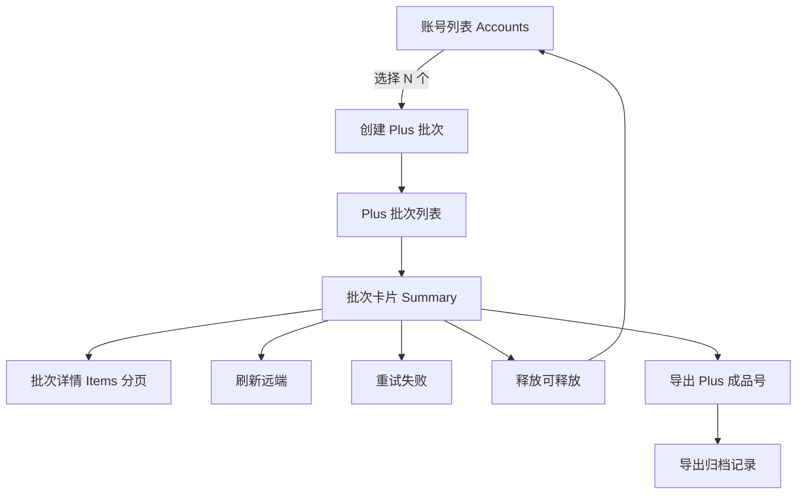

# Plus 开通批次任务系统 DBT 计划

## 目标

本计划只解决一件事：

> 把当前“UPI 开通进度散单列表”彻底改成**生产级 Plus 批次任务系统**：一次批量开通就是一个批次任务；账号加入批次后从普通账号池临时移走；批次内可刷新、重试、释放、导出 Plus 成品号、归档；导出与归档可追溯。

这里的“彻底”包含六层含义：

1. **批次是顶层对象**：用户提交 400 个账号，页面只显示 1 个 Plus 批次任务；400 个账号是该批次的 item 明细。
2. **账号有占用语义**：账号加入未结束批次后，不再出现在普通账号列表的默认可选池里，避免重复提交和重复扣 key。
3. **提交必须幂等**：连续点两次、浏览器重试、API 超时重发，都不能为同一个账号创建第二个 active item 或第二个远端 UPI 单。
4. **批次内闭环管理**：刷新远端、失败重试、释放可释放、释放回池、失败原因统计都按批次执行，不再全局乱扫。
5. **Plus 成品号按批次导出并归档**：每个批次都有“导出 Plus 成品号”按钮；导出只取该批次成功项；导出后写归档记录，成功账号标记导出/归档。
6. **批量最快且稳定**：提交 API 只负责批量预检、占用和创建 batch/item；远端提交由后台 worker 按限速异步推进；页面用 batch summary 轮询，明细分页加载。

## DBT 定义

- **D = Design**：设计与边界收敛；明确状态机、DB 契约、API 契约、UI 行为、迁移规则、旧实现去留。
- **B = Build**：实现代码；必须是最终实现，不做临时桥、假 fallback、注释 TODO 交付。
- **T = Test**：验证与验收；覆盖成功路径、重复提交、释放回池、批次导出归档、统计性能、旧数据兼容。

## 当前依据

### 当前现状

- Plus 校验任务仍是内存任务：`api/accounts.py` 的 `/accounts-bulk/verify-plus` 创建 `plus-verify-*` 内存任务。
- UPI 开通提交入口已经存在：`api/accounts.py` 的 `/accounts-bulk/activate-plus` 调 `services/upi_activation_service.py`。
- UPI 当前状态仍主要落在 `accounts.activation_*` 字段上。
- 当前 UPI 进度页 `frontend/src/pages/PlusProgress.tsx` 以全局账号状态列表展示散单，不是批次任务模型。
- 当前账号列表 `GET /api/accounts` 默认没有按 Plus active batch 占用隐藏账号。
- 当前已有 Plus 成品导出入口：`/accounts-bulk/export-plus-txt`，但它是按 keys 或全局导出，不是批次级导出归档。

### 当前问题

1. **400 单显示成 400 行散单**：用户实际需要 1 个批次任务 + 400 个明细。
2. **已提交账号仍可能被再次选择**：缺少 active batch 占用字段和 DB 级唯一约束。
3. **全局重试/释放不符合批量管理逻辑**：应该按批次或批次筛选结果操作。
4. **批次统计不可追溯**：缺少 batch summary、batch item、export record。
5. **导出 Plus 成品号没有批次归档语义**：无法准确回答“这个批次导出了几个、什么时候导出、导出文件在哪”。
6. **页面轮询散单成本高**：数据大时全局账号列表容易慢，应该轮询轻量 batch summary。

---

# 总体设计

## 最终用户链路

```text
账号列表选择 N 个账号
-> 点击“批量开通 Plus”
-> 后端预检并创建 1 个 plus_activation_batch
-> 后端 bulk insert N 个 plus_activation_batch_items
-> 后端 bulk update accounts.active_plus_batch_id / active_plus_item_id
-> API 立即返回 batch_key
-> Plus 批次页显示 1 张批次卡片
-> worker 按 batch/item 限速提交远端 UPI
-> 页面轮询 batch summary
-> 用户展开批次详情分页查看 item
-> 成功后点击“导出 Plus 成品号”
-> 写 plus_activation_exports，成功 item/account 标记 exported/archived
-> 批次可归档，历史仍可查
```

## 页面层级



## 模块划分

### 模块 A：DB Schema 与迁移

职责：
- 新增批次表、明细表、导出归档表。
- `accounts` 增加 active batch 占用字段。
- 建索引、唯一约束、兼容 SQLite/Postgres。
- 从旧 `accounts.activation_*` 数据迁移/映射到 legacy batch 或兼容展示。

核心文件：
- `infrastructure/db.py`
- `infrastructure/db_backend.py`（如需补 DDL 翻译）
- `tests/test_upi_activation.py` 或新增 `tests/test_plus_activation_batches.py`

### 模块 B：批次仓储层

职责：
- 封装 batch/item/export CRUD。
- 封装批量预检、批量占用、批量统计聚合。
- 避免 service 层手写散 SQL。

核心文件：
- 新增 `infrastructure/repositories/plus_activation_repository.py`
- 或新增 `application/plus_activation_batch_service.py` 内部私有 repo，但建议独立 repository。

### 模块 C：批次服务层

职责：
- 创建批次。
- 幂等提交。
- 批次 summary。
- 批次 item 分页查询。
- 批次内刷新、重试、释放。
- 批次导出 Plus 成品号并归档。
- 批次归档。

核心文件：
- 新增 `services/plus_activation_batch_service.py`
- 改造 `services/upi_activation_service.py`，让 worker 以 batch/item 为主。
- 保留旧 `/activation/tasks` 仅做兼容或重定向到 legacy view。

### 模块 D：API 层

职责：
- 暴露批次 API。
- 保留旧 API，但新 UI 只走批次 API。
- API 返回必须轻量、分页、可被前端轮询。

核心文件：
- `api/accounts.py` 可先承载路由。
- 后续可拆 `api/plus_activation.py`，但不要两个地方重复业务逻辑。

### 模块 E：前端 Plus 批次页

职责：
- 将 `PlusProgress.tsx` 从散单列表改为批次列表。
- 顶层只显示 batch cards。
- 详情抽屉/展开区分页展示 items。
- 每个 batch card 都有“导出 Plus 成品号”按钮。

核心文件：
- `frontend/src/pages/PlusProgress.tsx`
- `frontend/src/lib/api.ts`
- `frontend/src/lib/types.ts`

### 模块 F：测试与验收

职责：
- DB schema 测试。
- 幂等/重复提交测试。
- 账号隐藏/释放回池测试。
- 批次导出归档测试。
- worker 限速与状态推进测试。
- 前端 build 与关键 UI 行为 smoke。

---

# 状态机

## Batch 状态

| 状态 | 含义 | 可操作 |
|---|---|---|
| `queued` | 批次已创建，item 已占用，worker 尚未开始提交 | 取消、释放未提交、归档空批次 |
| `running` | 正在提交/轮询远端 | 刷新、暂停、释放可释放、查看明细 |
| `paused` | 人工暂停提交新 item；已提交远端的仍可刷新 | 继续、释放、导出已成功 |
| `completed` | 全部 item 成功或跳过且无失败 | 导出、归档 |
| `completed_with_failures` | 没有 active item，但存在失败/可释放 | 重试失败、释放失败、导出成功、归档 |
| `cancelled` | 批次被取消，未提交项释放，远端可释放项已尝试释放 | 导出已成功、归档 |
| `archived` | 历史归档，不再显示在默认活跃列表 | 查看、下载历史导出 |

## Item 状态

| 状态 | 含义 | 是否占用账号 | 是否可重复提交 |
|---|---|---:|---:|
| `reserved` | 已加入批次但未入提交队列 | 是 | 否 |
| `queued` | 等待 worker 提交远端 | 是 | 否 |
| `submitting` | 正在创建远端 UPI 单 | 是 | 否 |
| `submit_unknown` | 提交超时/异常，远端可能已创建，需要 idempotency 找回 | 是 | 否 |
| `submitted` | 远端已接单，有 remote_task_id | 是 | 否 |
| `processing` | 远端处理中 | 是 | 否 |
| `verifying` | 本地验证 Plus 状态中 | 是 | 否 |
| `verified` | 已确认 Plus 成功 | 是，直到导出归档 | 否 |
| `failed` | 终局失败或可人工处理失败 | 是，直到释放/重试/归档 | 仅批次内重试 |
| `releasable` | 远端/本地允许释放 | 是 | 释放后才可重新提交 |
| `released` | 已释放回账号池 | 否 | 是 |
| `skipped` | 预检跳过，不占用或已解除占用 | 否 | 视原因而定 |
| `exported` | Plus 成品已导出 | 是，准备归档 | 否 |
| `archived` | item 已归档 | 否或历史占用 | 否 |

## 账号占用状态

`accounts` 上的 active 字段用于快速过滤普通账号池：

- `active_plus_batch_id` 非空：账号正在某个未归档 Plus 批次中。
- `active_plus_item_id` 非空：账号对应当前 active item。
- `plus_batch_status`：冗余展示和过滤字段，取 item 当前状态。
- `plus_reserved_at`：账号被批次占用时间。
- `plus_archived_at`：Plus 成品已归档时间。

普通账号列表默认过滤：

```text
active_plus_batch_id IS NULL
AND plus_archived_at IS NULL
AND export_status NOT IN ('exported_plus_archived')
```

可加参数 `include_plus_batch=1` 允许管理页查看全部。

---

# DB 设计

## 表 1：`plus_activation_batches`

一批任务一行。页面顶层只读这个表即可展示批次卡片。

```sql
CREATE TABLE IF NOT EXISTS plus_activation_batches (
  id INTEGER PRIMARY KEY AUTOINCREMENT,
  batch_key TEXT NOT NULL UNIQUE,
  name TEXT NOT NULL DEFAULT '',
  provider TEXT NOT NULL DEFAULT 'upi',
  channel TEXT NOT NULL DEFAULT 'upi',
  status TEXT NOT NULL DEFAULT 'queued',
  requested_count INTEGER NOT NULL DEFAULT 0,
  accepted_count INTEGER NOT NULL DEFAULT 0,
  skipped_count INTEGER NOT NULL DEFAULT 0,
  total_count INTEGER NOT NULL DEFAULT 0,
  reserved_count INTEGER NOT NULL DEFAULT 0,
  queued_count INTEGER NOT NULL DEFAULT 0,
  submitting_count INTEGER NOT NULL DEFAULT 0,
  submit_unknown_count INTEGER NOT NULL DEFAULT 0,
  submitted_count INTEGER NOT NULL DEFAULT 0,
  processing_count INTEGER NOT NULL DEFAULT 0,
  verifying_count INTEGER NOT NULL DEFAULT 0,
  verified_count INTEGER NOT NULL DEFAULT 0,
  failed_count INTEGER NOT NULL DEFAULT 0,
  releasable_count INTEGER NOT NULL DEFAULT 0,
  released_count INTEGER NOT NULL DEFAULT 0,
  exported_count INTEGER NOT NULL DEFAULT 0,
  archived_count INTEGER NOT NULL DEFAULT 0,
  cdk_consumed_count INTEGER NOT NULL DEFAULT 0,
  submit_rate_per_min INTEGER NOT NULL DEFAULT 0,
  max_in_flight INTEGER NOT NULL DEFAULT 0,
  progress_percent INTEGER NOT NULL DEFAULT 0,
  success_rate_percent INTEGER NOT NULL DEFAULT 0,
  last_error TEXT NOT NULL DEFAULT '',
  last_error_code TEXT NOT NULL DEFAULT '',
  error_summary_json TEXT NOT NULL DEFAULT '{}',
  created_by TEXT NOT NULL DEFAULT '',
  created_at TEXT NOT NULL,
  started_at TEXT NOT NULL DEFAULT '',
  finished_at TEXT NOT NULL DEFAULT '',
  updated_at TEXT NOT NULL,
  archived_at TEXT NOT NULL DEFAULT ''
);
```

### 索引

```sql
CREATE INDEX IF NOT EXISTS idx_plus_batches_status_updated
  ON plus_activation_batches(status, updated_at DESC);

CREATE INDEX IF NOT EXISTS idx_plus_batches_created
  ON plus_activation_batches(created_at DESC);
```

## 表 2：`plus_activation_batch_items`

批次里的每个账号一行。批次详情页分页读这个表。

```sql
CREATE TABLE IF NOT EXISTS plus_activation_batch_items (
  id INTEGER PRIMARY KEY AUTOINCREMENT,
  batch_id INTEGER NOT NULL,
  batch_key TEXT NOT NULL,
  item_key TEXT NOT NULL UNIQUE,
  account_id_ref INTEGER NOT NULL,
  account_key TEXT NOT NULL,
  email TEXT NOT NULL DEFAULT '',
  status TEXT NOT NULL DEFAULT 'queued',
  provider TEXT NOT NULL DEFAULT 'upi',
  channel TEXT NOT NULL DEFAULT 'upi',
  remote_task_id TEXT NOT NULL DEFAULT '',
  idempotency_key TEXT NOT NULL DEFAULT '',
  client_key_hash TEXT NOT NULL DEFAULT '',
  activation_attempt INTEGER NOT NULL DEFAULT 0,
  retry_count INTEGER NOT NULL DEFAULT 0,
  activation_error TEXT NOT NULL DEFAULT '',
  activation_error_code TEXT NOT NULL DEFAULT '',
  activation_display TEXT NOT NULL DEFAULT '',
  can_release INTEGER NOT NULL DEFAULT 0,
  cdk_consumed INTEGER NOT NULL DEFAULT 0,
  exported_at TEXT NOT NULL DEFAULT '',
  export_key TEXT NOT NULL DEFAULT '',
  archived_at TEXT NOT NULL DEFAULT '',
  submitted_at TEXT NOT NULL DEFAULT '',
  finished_at TEXT NOT NULL DEFAULT '',
  released_at TEXT NOT NULL DEFAULT '',
  last_polled_at TEXT NOT NULL DEFAULT '',
  created_at TEXT NOT NULL,
  updated_at TEXT NOT NULL,
  FOREIGN KEY(batch_id) REFERENCES plus_activation_batches(id) ON DELETE CASCADE,
  FOREIGN KEY(account_id_ref) REFERENCES accounts(id) ON DELETE CASCADE
);
```

### 索引

```sql
CREATE INDEX IF NOT EXISTS idx_plus_items_batch_status_updated
  ON plus_activation_batch_items(batch_id, status, updated_at DESC);

CREATE INDEX IF NOT EXISTS idx_plus_items_batch_account
  ON plus_activation_batch_items(batch_id, account_key);

CREATE INDEX IF NOT EXISTS idx_plus_items_status_updated
  ON plus_activation_batch_items(status, updated_at DESC);

CREATE INDEX IF NOT EXISTS idx_plus_items_remote_task
  ON plus_activation_batch_items(remote_task_id);

CREATE INDEX IF NOT EXISTS idx_plus_items_idempotency
  ON plus_activation_batch_items(idempotency_key);
```

### Active item 唯一约束

SQLite/Postgres 都应支持 partial index。目标：同一个账号同时只能有一个未释放/未归档 active item。

```sql
CREATE UNIQUE INDEX IF NOT EXISTS uq_plus_items_one_active_per_account
  ON plus_activation_batch_items(account_id_ref)
  WHERE status IN (
    'reserved', 'queued', 'submitting', 'submit_unknown',
    'submitted', 'processing', 'verifying', 'verified',
    'failed', 'releasable', 'exported'
  );
```

说明：
- `released`、`skipped`、`archived` 不占 active 唯一位。
- `verified` 仍占位，直到导出/归档，防止成功 Plus 号又被误提交。
- `failed` 仍占位，必须在批次内重试或释放，不能从账号列表重新提交。

## 表 3：`plus_activation_exports`

每次批次导出都留档。

```sql
CREATE TABLE IF NOT EXISTS plus_activation_exports (
  id INTEGER PRIMARY KEY AUTOINCREMENT,
  export_key TEXT NOT NULL UNIQUE,
  batch_id INTEGER NOT NULL,
  batch_key TEXT NOT NULL,
  kind TEXT NOT NULL DEFAULT 'plus_verified',
  format TEXT NOT NULL DEFAULT 'txt',
  file_path TEXT NOT NULL DEFAULT '',
  file_name TEXT NOT NULL DEFAULT '',
  count INTEGER NOT NULL DEFAULT 0,
  checksum TEXT NOT NULL DEFAULT '',
  include_already_exported INTEGER NOT NULL DEFAULT 0,
  archive_after_export INTEGER NOT NULL DEFAULT 1,
  created_by TEXT NOT NULL DEFAULT '',
  created_at TEXT NOT NULL,
  FOREIGN KEY(batch_id) REFERENCES plus_activation_batches(id) ON DELETE CASCADE
);
```

### 索引

```sql
CREATE INDEX IF NOT EXISTS idx_plus_exports_batch_created
  ON plus_activation_exports(batch_id, created_at DESC);
```

## `accounts` 新增字段

```sql
ALTER TABLE accounts ADD COLUMN active_plus_batch_id INTEGER;
ALTER TABLE accounts ADD COLUMN active_plus_batch_key TEXT DEFAULT '';
ALTER TABLE accounts ADD COLUMN active_plus_item_id INTEGER;
ALTER TABLE accounts ADD COLUMN plus_batch_status TEXT DEFAULT '';
ALTER TABLE accounts ADD COLUMN plus_reserved_at TEXT DEFAULT '';
ALTER TABLE accounts ADD COLUMN plus_archived_at TEXT DEFAULT '';
ALTER TABLE accounts ADD COLUMN plus_export_batch_key TEXT DEFAULT '';
ALTER TABLE accounts ADD COLUMN plus_export_key TEXT DEFAULT '';
```

索引：

```sql
CREATE INDEX IF NOT EXISTS idx_accounts_active_plus_batch
  ON accounts(active_plus_batch_id, plus_batch_status);

CREATE INDEX IF NOT EXISTS idx_accounts_plus_archived
  ON accounts(plus_archived_at);
```

## 统计刷新策略

`plus_activation_batches` 的计数字段是 summary cache，不是唯一真相。真相在 `plus_activation_batch_items`。

每次 item 状态变更后调用：

```sql
SELECT status, COUNT(*)
FROM plus_activation_batch_items
WHERE batch_id = ?
GROUP BY status;
```

然后更新 batch summary 字段。

要求：
- 单 item 状态变更可以增量更新，定期全量 reconcile。
- API `GET /batches` 只读 batch summary，不扫 item。
- API `GET /batches/{batch}/items` 才分页查 item。

---

# 预检与幂等设计

## 创建批次预检结果

创建批次前对传入 keys 去重并分类：

| 分类 | 条件 | 动作 |
|---|---|---|
| `accepted` | 账号存在、有 token、不是已归档 Plus、不在 active batch | 创建 item 并占用账号 |
| `already_in_batch` | `accounts.active_plus_batch_id IS NOT NULL` 或 active item 唯一约束命中 | 跳过，返回所在 batch_key |
| `already_plus` | `plus_status=verified_plus` 且未指定导出归档策略 | 跳过或标为可导出历史，不远端提交 |
| `already_exported` | `plus_archived_at` 非空或 `export_status=exported_plus_archived` | 跳过 |
| `missing_token` | `account_credentials.access_token=''` | 预检失败，不提交 |
| `invalid_state` | 账号 archived/banned/状态不允许 | 预检失败 |
| `duplicate_input` | 同一请求里重复 key | 跳过 |

API 必须返回 summary：

```json
{
  "ok": true,
  "batch_key": "plus_batch_20260722_153000_ab12cd",
  "requested": 400,
  "accepted": 386,
  "skipped": 14,
  "skip_counts": {
    "already_in_batch": 8,
    "already_plus": 3,
    "missing_token": 3
  }
}
```

## 幂等原则

- `batch_key` 由服务端生成。
- `item_key = batch_key + ':' + stable account id/key hash`。
- `idempotency_key` 生成后写入 item，重试提交远端必须复用，不能每次换。
- DB partial unique index 防止同账号多 active item。
- 账号占用字段和 item insert 必须在同一事务内完成。
- API 超时后前端重试同一 keys 时，已占用账号返回 `already_in_batch`，不会重新开单。

---

# API 设计

建议新增统一前缀：`/api/plus-activation`。

## 创建批次

`POST /api/plus-activation/batches`

Request：

```json
{
  "keys": ["a@example.com", "b@example.com"],
  "channel": "upi",
  "name": "UPI开通400单",
  "force_released": false,
  "dry_run": false
}
```

Response：

```json
{
  "ok": true,
  "batch": {
    "batch_key": "plus_batch_20260722_153000_ab12cd",
    "name": "UPI开通400单",
    "status": "running",
    "requested_count": 400,
    "accepted_count": 386,
    "skipped_count": 14,
    "total_count": 386
  },
  "skip_counts": {
    "already_in_batch": 8,
    "already_plus": 3,
    "missing_token": 3
  },
  "message": "已创建 Plus 开通批次：386 个账号进入队列，14 个跳过"
}
```

`dry_run=true` 时只预检，不创建 batch/item，不占用账号。

## 批次列表

`GET /api/plus-activation/batches?status=active&limit=50&offset=0`

Response：

```json
{
  "ok": true,
  "items": [
    {
      "batch_key": "plus_batch_20260722_153000_ab12cd",
      "name": "UPI开通400单",
      "status": "running",
      "total_count": 386,
      "submitted_count": 120,
      "processing_count": 80,
      "verified_count": 50,
      "failed_count": 10,
      "releasable_count": 6,
      "exported_count": 0,
      "progress_percent": 42,
      "success_rate_percent": 13,
      "created_at": "...",
      "updated_at": "..."
    }
  ],
  "total": 1
}
```

## 批次详情 summary

`GET /api/plus-activation/batches/{batch_key}`

返回 batch summary、错误排行榜、最近导出记录。

## 批次 item 分页

`GET /api/plus-activation/batches/{batch_key}/items?status=failed&error=灰度&search=outlook&limit=80&offset=0`

要求：
- 默认 limit=80，最大 500。
- 支持状态筛选、错误原因筛选、邮箱搜索、只看未导出。
- 不返回 token 明文。

## 刷新远端

`POST /api/plus-activation/batches/{batch_key}/refresh`

Request：

```json
{
  "statuses": ["submitted", "processing", "submit_unknown"],
  "limit": 200
}
```

说明：
- 立即唤醒 worker。
- 可同步处理少量 item，也可只返回 accepted refresh job。
- 不允许跨批次全局刷新作为默认行为。

## 重试失败

`POST /api/plus-activation/batches/{batch_key}/retry`

Request：

```json
{
  "statuses": ["failed", "releasable", "released"],
  "error_contains": "灰度",
  "only_released": false,
  "limit": 100000,
  "channel": "upi"
}
```

规则：
- `failed/releasable` 默认在原批次内重试，保留 `retry_count`。
- 如果 item 仍有 remote_task_id 且 can_release=1，默认先 release 再重新 queue，避免远端占用 key。
- `verified/exported/archived` 永不重试。

## 释放可释放

`POST /api/plus-activation/batches/{batch_key}/release`

Request：

```json
{
  "statuses": ["failed", "releasable", "submitted", "processing"],
  "only_can_release": true,
  "error_contains": "二维码过期",
  "limit": 100000
}
```

行为：
- 本地未提交：直接 item=`released`，清空账号占用。
- 远端可释放：调用 UPI release，成功后 item=`released`，清空账号占用。
- 远端不可释放：保留 item，返回 failed result，不清空占用。
- `verified/exported/archived` 默认不释放。

## 导出 Plus 成品号

`POST /api/plus-activation/batches/{batch_key}/export-plus`

Request：

```json
{
  "format": "txt",
  "include_already_exported": false,
  "archive_after_export": true,
  "fields": ["email", "password", "plus_verified_at", "batch_key"]
}
```

Response：

```json
{
  "ok": true,
  "export_key": "plus_export_20260722_160000_cd34ef",
  "batch_key": "plus_batch_20260722_153000_ab12cd",
  "count": 120,
  "file_name": "plus_batch_20260722_153000_ab12cd_plus_120.txt",
  "download_url": "/api/plus-activation/exports/plus_export_20260722_160000_cd34ef/download",
  "archived": 120
}
```

导出后必须：
- 写 `plus_activation_exports`。
- 对导出的 item 设置 `exported_at/export_key/status='exported'`。
- 对账号设置：
  - `export_status='exported_plus_archived'`
  - `export_kind='plus_batch'`
  - `exported_at=now`
  - `plus_export_batch_key=batch_key`
  - `plus_export_key=export_key`
  - `plus_archived_at=now`（当 `archive_after_export=true`）
  - 清空 active batch 字段或转为历史归档语义。
- 更新 batch `exported_count/archived_count`。

## 导出历史与下载

- `GET /api/plus-activation/batches/{batch_key}/exports`
- `GET /api/plus-activation/exports/{export_key}/download`

## 批次归档

`POST /api/plus-activation/batches/{batch_key}/archive`

规则：
- 有 active item 时默认拒绝，除非 `force=true` 且已处理释放/导出。
- 已完成/已导出/已释放/已失败处理完的批次可归档。
- 归档后默认不出现在活跃批次列表。

---

# Worker 设计

## Worker 主循环

```text
loop:
  load runtime config
  find active batches ordered by created_at
  for each batch:
    submit queued/reserved items while under rate limit and max in-flight
    poll submitted/processing/submit_unknown items due for polling
    apply remote task result to item and account
    refresh batch summary
  sleep or wait wake event
```

## 限速

- `upi_submit_per_key_per_min` 控制每个 client key 每分钟提交量。
- `max_submissions_per_key` 控制同时远端占用量。
- 多 key 时按 key hash 分桶轮询。
- 提交 400 单时 API 不阻塞；worker 预计时间写到 batch summary：`estimated_submit_done_at` 可后续加。

## 远端状态映射

| 远端/旧状态 | 新 item 状态 | 账号字段 |
|---|---|---|
| local queued | `queued` | `plus_batch_status='queued'` |
| creating remote | `submitting` | `plus_batch_status='submitting'` |
| submit timeout unknown | `submit_unknown` | 保存 idempotency key |
| remote task created | `submitted` | `activation_task_id=remote_task_id` |
| remote processing | `processing` | `activation_status='processing'` |
| remote success + local plus verified | `verified` | `plus_status='verified_plus'` |
| remote failed no release | `failed` | `activation_error` 保存原因 |
| failed can release | `releasable` 或 `failed+can_release=1` | `activation_can_release=1` |
| release success | `released` | 清空 active batch 字段 |

## 账号表兼容写入

短期内仍同步写 `accounts.activation_*`，保证旧 API/页面/脚本不崩。

但新系统的事实来源是：

```text
plus_activation_batches
plus_activation_batch_items
plus_activation_exports
```

---

# 前端设计

## Plus 批次页顶层

替换当前全局散单表，默认显示批次卡片。

每个批次卡片显示：

- 批次名
- 批次 ID
- 状态 badge
- 创建时间 / 更新时间
- 总数
- 已提交
- 处理中
- 成功
- 失败
- 可释放
- 已导出
- CDK 消耗
- 进度条
- 成功率
- 最近错误摘要

按钮：

- `查看明细`
- `刷新远端`
- `重试失败`
- `释放可释放`
- `导出 Plus 成品号`
- `归档批次`

## 批次详情

详情区/抽屉分页展示 item：

筛选：
- 状态
- 错误原因
- 搜索邮箱
- 只看成功
- 只看失败
- 只看可释放
- 只看未导出

列表列：
- 邮箱
- 状态
- remote task id
- 错误原因
- 是否可释放
- 是否消耗 CDK
- retry_count
- exported_at
- updated_at

单行操作：
- 释放
- 重试
- 复制错误

## 账号列表隐藏规则

账号列表默认隐藏：

```text
active_plus_batch_id != NULL
OR plus_archived_at != ''
OR export_status = 'exported_plus_archived'
```

UI 增加可选开关：

- `显示 Plus 批次占用账号`
- `显示已归档 Plus 成品号`

默认关闭，避免批量选择时误选。

## 导出按钮行为

每个批次卡片必须有：

```text
导出 Plus 成品号
```

点击后弹窗：

- 导出格式：TXT / CSV / JSON
- 字段模板：
  - `email----password`
  - `email,password,verified_at,batch_key`
  - JSON full product
- 是否包含已导出：默认否
- 导出后归档：默认是

导出成功后显示：

- 导出数量
- 下载按钮
- 归档数量
- 历史导出记录

---

# 并行策略

## 可以并行的工作流

### Workstream 1 — DB schema + repository

范围：模块 A/B。

原因：
- 不依赖前端。
- 是服务和 API 的基础。
- 只要先锁定表结构即可独立开发。

### Workstream 2 — API DTO + frontend type skeleton

范围：模块 D/E 的类型定义和接口封装。

原因：
- 可基于本文 API contract 先写 TS types 和 api.ts。
- 不碰业务服务实现。

### Workstream 3 — Worker batch adapter

范围：模块 C 的 worker 改造。

原因：
- 可在 repository mock 上开发。
- 需要与 Workstream 1 对齐 item 状态机。

## 不应并行的点

### 1. DB schema 命名与状态枚举

原因：
- 一旦多人同时改，会导致 API、前端、测试全部错位。

处理：
- 先合入 schema + constants，再分工。

### 2. `accounts` 占用字段写入规则

原因：
- 这是防重复提交和账号列表隐藏的核心。

处理：
- 只能由批次服务统一写，其他服务不得直接清空 active_plus 字段。

### 3. 导出归档语义

原因：
- 导出后账号是否回池、是否归档、是否再次可提交必须唯一。

处理：
- 批次 export service 统一处理。

---

# DBT 明细（按小项目拆分）

## 小项目 1：锁定状态机与 DB Schema

### D

- [ ] 确认 batch 状态集合：`queued/running/paused/completed/completed_with_failures/cancelled/archived`。
- [ ] 确认 item 状态集合：`reserved/queued/submitting/submit_unknown/submitted/processing/verifying/verified/failed/releasable/released/skipped/exported/archived`。
- [ ] 确认 `verified/failed` 仍占用账号，必须导出归档或释放后才离开普通池。
- [ ] 确认 `released/skipped/archived` 不占 active unique 位。
- [ ] 确认 batch summary 字段是 cache，item 是事实来源。
- [ ] 确认 SQLite/Postgres partial unique index 方案。

### B

- [ ] 在 `infrastructure/db.py` 新增三张表 DDL。
- [ ] 在 `infrastructure/db.py` 给 `accounts` 添加 active plus 字段迁移。
- [ ] 添加索引：batch status、item batch/status、item active unique、account active plus。
- [ ] 如 DDL 翻译不支持 partial index，补 `db_backend` 翻译或条件分支。
- [ ] 新增常量文件或 service 内常量，避免状态字符串散落。

### T

- [ ] SQLite fresh schema 包含三张新表和 accounts active plus 字段。
- [ ] Postgres init 路径包含新表和字段迁移。
- [ ] 同一账号插入两个 active item 失败。
- [ ] 同一账号插入 active item + released item 成功。
- [ ] batch/item/export 外键存在且 cascade 行为符合预期。

## 小项目 2：PlusActivationRepository

### D

- [ ] 定义 repository 方法清单：create_batch、insert_items、claim_accounts、list_batches、list_items、refresh_summary、mark_item_status、release_item、mark_exported。
- [ ] 所有批量写入必须有事务边界。
- [ ] 所有 list 方法必须分页，禁止默认返回 10 万 item 给前端。

### B

- [ ] 新增 `infrastructure/repositories/plus_activation_repository.py`。
- [ ] 实现 `create_batch_with_items(keys, precheck_result)` 单事务。
- [ ] 实现 `precheck_keys(keys)`，JOIN accounts/account_credentials 和 active batch 字段。
- [ ] 实现 `refresh_batch_summary(batch_id)` 聚合 item 状态并更新 batch。
- [ ] 实现 `list_batch_items(batch_key, filters, limit, offset)`。
- [ ] 实现 `list_export_records(batch_key)`。

### T

- [ ] 预检能分类 accepted / already_in_batch / missing_token / already_plus / duplicate_input。
- [ ] 创建批次后 accounts active 字段被写入。
- [ ] 事务中任一 item insert 失败时 accounts 不残留半占用。
- [ ] summary 聚合结果与 item 表一致。
- [ ] item 分页不返回 token 明文。

## 小项目 3：创建批次 API 与账号列表隐藏

### D

- [ ] 新 API 统一使用 `/api/plus-activation/batches`。
- [ ] `dry_run=true` 只预检，不占用账号。
- [ ] 账号列表默认隐藏 active plus batch 和 plus archived 账号。
- [ ] 账号列表提供显式参数显示隐藏账号。

### B

- [ ] 新增 Pydantic request/response DTO。
- [ ] 实现 `POST /api/plus-activation/batches`。
- [ ] 实现 `GET /api/plus-activation/batches`。
- [ ] 实现 `GET /api/plus-activation/batches/{batch_key}`。
- [ ] 修改 `GET /api/accounts` 默认过滤 active plus 占用账号。
- [ ] 旧 `/accounts-bulk/activate-plus` 改为调用新 batch service，返回 batch_key；或保留兼容但不再直接散单 enqueue。

### T

- [ ] 400 keys 创建只返回一个 batch_key。
- [ ] 创建批次后这些账号默认不出现在 `/api/accounts`。
- [ ] `include_plus_batch=1` 时能看到占用账号。
- [ ] 重复提交同一批 keys 不创建第二个 active item。
- [ ] dry_run 不写 DB。

## 小项目 4：Worker 改为 batch/item 驱动

### D

- [ ] worker 以 active batch 为顶层扫描对象。
- [ ] worker 每次只提交 batch 下 queued/reserved item。
- [ ] idempotency_key 在 item 创建时固定，重试必须复用或按明确规则新建。
- [ ] submit_unknown 必须先 reconcile，不直接重复创建。
- [ ] 旧 accounts.activation_* 只作为兼容镜像，不再作为新系统事实来源。

### B

- [ ] `services/plus_activation_batch_service.py` 实现 worker 主循环或 adapter。
- [ ] 改造 `services/upi_activation_service.py` 的提交、轮询、release 方法，使其接收 item/batch context。
- [ ] item 状态变化同步写 accounts activation mirror 字段。
- [ ] 每次状态变化刷新 batch summary。
- [ ] worker 启动时 reconcile stuck `submitting/submit_unknown`。

### T

- [ ] queued item 被限速提交到 submitted。
- [ ] remote success 后 item=verified 且 account.plus_status=verified_plus。
- [ ] remote failure 后 item=failed/releasable 且错误落 item/account。
- [ ] submit_unknown 不会重复创建远端单。
- [ ] worker 重启后继续处理旧 active batch。

## 小项目 5：批次详情、刷新、重试、释放 API

### D

- [ ] 批次详情 item 必须分页。
- [ ] 刷新/重试/释放默认只作用于指定 batch。
- [ ] 释放成功必须清空 accounts active plus 字段。
- [ ] verified/exported/archived 默认不可释放、不可重试。

### B

- [ ] 实现 `GET /api/plus-activation/batches/{batch_key}/items`。
- [ ] 实现 `POST /api/plus-activation/batches/{batch_key}/refresh`。
- [ ] 实现 `POST /api/plus-activation/batches/{batch_key}/retry`。
- [ ] 实现 `POST /api/plus-activation/batches/{batch_key}/release`。
- [ ] release 支持本地未提交释放和远端 release。
- [ ] retry 支持状态筛选和错误原因筛选。

### T

- [ ] 只释放当前 batch 的 item，不影响其他批次历史。
- [ ] released item 后账号重新出现在默认账号列表。
- [ ] retry failed item 不创建第二个 active item。
- [ ] refresh 只轮询 submitted/processing/submit_unknown。
- [ ] verified item release 请求被拒绝且原因明确。

## 小项目 6：批次 Plus 成品号导出与归档

### D

- [ ] 每个 batch card 必须有“导出 Plus 成品号”。
- [ ] 导出范围只允许当前 batch 的 verified item。
- [ ] 默认不包含已导出 item。
- [ ] 默认导出后归档账号和 item。
- [ ] 导出必须写 `plus_activation_exports`。
- [ ] 导出文件路径必须在可控输出目录，不允许任意路径。

### B

- [ ] 实现 `POST /api/plus-activation/batches/{batch_key}/export-plus`。
- [ ] 实现 `GET /api/plus-activation/batches/{batch_key}/exports`。
- [ ] 实现 `GET /api/plus-activation/exports/{export_key}/download`。
- [ ] 支持 TXT/CSV/JSON 三种格式。
- [ ] 写 checksum。
- [ ] 更新 item `exported_at/export_key/status`。
- [ ] 更新 account `export_status/export_kind/exported_at/plus_export_key/plus_archived_at`。
- [ ] 更新 batch `exported_count/archived_count`。

### T

- [ ] 只导出 verified_plus 成品号。
- [ ] failed/processing/released 不进入导出文件。
- [ ] 导出后再次导出默认 count=0。
- [ ] `include_already_exported=true` 可重新生成包含历史的文件。
- [ ] 导出后账号默认不出现在账号列表。
- [ ] 下载接口返回正确文件和 content type。

## 小项目 7：前端批次页重做

### D

- [ ] 顶层只显示批次卡片，不显示全局 500 散单。
- [ ] 批次详情分页懒加载 item。
- [ ] 每个批次卡片包含刷新、重试、释放、导出、归档按钮。
- [ ] 创建批次后自动跳转/聚焦新 batch。
- [ ] 账号列表批量开通入口显示 dry-run 预检结果。

### B

- [ ] `frontend/src/lib/types.ts` 增加 batch/item/export 类型。
- [ ] `frontend/src/lib/api.ts` 增加 plus activation batch API。
- [ ] `PlusProgress.tsx` 改为 batch list + batch detail。
- [ ] 账号列表提交 Plus 改调用新 batch API。
- [ ] 账号列表加隐藏/显示 active plus 占用账号的开关。
- [ ] 导出成功弹出下载链接和导出数量。

### T

- [ ] `npm run build` 通过。
- [ ] 批次列表空状态明确。
- [ ] 400 item 不一次性渲染，详情分页正常。
- [ ] 按钮 loading/disabled 状态正确，重复点击不会重复提交。
- [ ] 导出按钮只在有 verified 或已导出历史时给出合理提示。

## 小项目 8：旧数据兼容与迁移

### D

- [ ] 当前 `accounts.activation_*` 中已有 active/failed/verified 数据不能丢。
- [ ] 旧散单可以生成一个 `legacy_upi_activation_import` 批次，或继续只在 legacy tab 展示。
- [ ] 新批次系统上线后，旧 `/activation/tasks` 不再作为主 UI 数据源。

### B

- [ ] 写一次性迁移：把未空 `activation_status` 的旧账号导入 legacy batch item，保留 remote_task_id/error。
- [ ] 已 verified/failed/released 的旧数据按状态映射。
- [ ] 对无法确定批次的旧数据标记 `batch_key='legacy_upi_activation_import'`。
- [ ] 旧 API 返回时可从新表读，或明确标记 deprecated。

### T

- [ ] 迁移前后旧 activation 状态数量一致。
- [ ] legacy batch 可在批次页查看。
- [ ] legacy verified 可导出，但不会误归入新批次。
- [ ] 迁移可重复执行，不创建重复 item。

## 小项目 9：性能与批量压测

### D

- [ ] 创建 400/1000 item 必须使用批量 insert/update，不逐账号提交 HTTP。
- [ ] 批次列表只查 batch summary，不扫 item。
- [ ] item 明细分页默认 80，最大 500。
- [ ] 统计错误排行榜用 SQL 聚合。

### B

- [ ] repository bulk insert 优化。
- [ ] batch summary query 加索引。
- [ ] item list query explain/索引覆盖。
- [ ] worker 每轮处理数量可配置，避免长事务锁 UI。

### T

- [ ] 400 账号创建批次 API 在本地 DB 下不超时。
- [ ] 1000 item 批次列表查询小于可接受阈值。
- [ ] item 分页查询稳定。
- [ ] 并发两个创建请求包含同一账号时，只有一个成功占用。
- [ ] worker 运行时账号列表和批次列表不被长锁卡死。

## 小项目 10：最终切换与删除散单主路径

### D

- [ ] 新 UI 完成后，PlusProgress 不再默认显示全局散单。
- [ ] 旧散单 API 保留兼容一段时间，但文档标记 deprecated。
- [ ] 所有批量 Plus 提交入口统一走 batch create。

### B

- [ ] 替换账号列表的“批量开通 Plus”调用。
- [ ] 替换 PlusProgress 页数据源。
- [ ] 旧 `/accounts-bulk/activate-plus` 内部调用新 service。
- [ ] 删除前端 localStorage plus verify task 对 UPI 开通的误导性展示。
- [ ] 更新 docs/operations 如有入口说明。

### T

- [ ] 端到端：选 20 个账号 -> 创建 1 个 batch -> 账号列表隐藏 -> worker 处理 -> 批次详情显示 20 item。
- [ ] 释放失败项 -> 账号回账号列表。
- [ ] 成功项导出 -> 生成 export record -> 账号归档隐藏。
- [ ] 旧 API smoke 不破坏已有自动化。

---

# 总体验收清单

## 功能验收

- [ ] 一次批量开通 400 个账号，页面顶层只出现 1 个批次任务。
- [ ] 批次详情里能分页看到 400 个 item。
- [ ] 加入批次的账号默认从账号列表消失。
- [ ] 重复提交同一批账号不会重复创建 active item 或远端单。
- [ ] 批次内可刷新远端状态。
- [ ] 批次内可重试失败项。
- [ ] 批次内可释放可释放项，释放后账号回普通账号池。
- [ ] 每个批次都有“导出 Plus 成品号”按钮。
- [ ] 导出只包含当前批次 verified Plus 成功项。
- [ ] 导出后有归档记录，可下载历史文件。
- [ ] 导出归档后的成品号默认不再出现在账号列表和待开通池。
- [ ] 批次可归档，归档后不出现在默认活跃批次列表。

## 稳定性验收

- [ ] API 超时重试不导致重复提交。
- [ ] 浏览器连续点击提交按钮不导致重复提交。
- [ ] worker 重启后 active batch 继续推进。
- [ ] DB partial unique index 阻止同账号多 active item。
- [ ] release 失败不会错误清空账号占用。
- [ ] export 写文件失败不会错误标记 item/account exported。
- [ ] 批次 summary 与 item 聚合可 reconcile。

## 性能验收

- [ ] 创建 400 item 的 batch API 快速返回，不等待远端提交完成。
- [ ] 创建 1000 item 的 batch 不产生 UI 超时。
- [ ] 批次列表轮询不扫 item 大表。
- [ ] item 明细分页渲染，不一次渲染 400/1000 行。
- [ ] worker 限速符合 `upi_submit_per_key_per_min`。

## 数据安全验收

- [ ] 批次列表和 item 列表不返回 access_token/refresh_token/id_token 明文。
- [ ] 导出 Plus 成品号字段由 request fields 控制，默认不导出 token。
- [ ] 导出文件路径固定在 `output/plus_exports/` 或等价受控目录。
- [ ] 下载接口只能下载 `plus_activation_exports` 记录中的文件。
- [ ] release/export/archive 操作有明确 batch_key，不允许全局误操作。

---

# 推荐开发顺序

必须按下面顺序推进，避免返工：

1. [ ] **先做小项目 1**：schema + 状态常量 + DB 约束。
2. [ ] **再做小项目 2**：repository + 事务化预检/占用/summary。
3. [ ] **再做小项目 3**：创建批次 API + 账号列表隐藏。
4. [ ] **再做小项目 4**：worker batch/item 驱动。
5. [ ] **再做小项目 5**：批次详情、刷新、重试、释放。
6. [ ] **再做小项目 6**：批次导出 Plus 成品号与归档。
7. [ ] **再做小项目 7**：前端批次页重做。
8. [ ] **再做小项目 8**：旧数据迁移/兼容。
9. [ ] **再做小项目 9**：性能压测与索引调优。
10. [ ] **最后做小项目 10**：切换入口，弱化旧散单主路径。

不可跳过：

- [ ] 不能先改 UI 假装批次；必须先有 DB batch/item。
- [ ] 不能只靠前端隐藏账号；必须有 DB active 占用字段和 unique index。
- [ ] 不能全局导出 Plus；必须按 batch export 归档。
- [ ] 不能全局重试失败；默认必须按 batch。
- [ ] 不能导出后不归档；成品号必须离开待处理池。

---

# 开发时的关键决策

## 决策 1：导出后是否清空 active_plus_batch_id

推荐：导出归档后清空 active 字段，同时写历史字段：

- `active_plus_batch_id = NULL`
- `active_plus_item_id = NULL`
- `plus_batch_status = 'archived'`
- `plus_export_batch_key = batch_key`
- `plus_export_key = export_key`
- `plus_archived_at = now`
- `export_status = 'exported_plus_archived'`

原因：
- 普通账号列表用 active 字段过滤在批次中的账号。
- 导出归档后的成品号用 `plus_archived_at/export_status` 过滤。
- 两类隐藏原因可区分。

## 决策 2：失败项是否自动释放

推荐：不自动释放，除非用户点击释放。

原因：
- 失败原因可能需要复盘。
- 部分失败可能已消耗 CDK 或远端仍占用。
- 自动释放容易把问题账号混回账号池造成重复提交。

## 决策 3：重试在原批次还是新批次

推荐默认在原批次内重试，增加 `retry_count`。

原因：
- 用户要看“这批 400 单最终成了多少”。
- 原批次统计更符合批量管理。
- 后续如果需要成本核算，再加“创建重试子批次”。

## 决策 4：旧 `/activation/tasks` 怎么办

推荐：保留兼容，但新 UI 不再依赖。

原因：
- 避免破坏已有脚本。
- 但散单列表不是最终产品逻辑，不能继续作为主页面。

---

# 最终 Done 定义

只有下面全部满足，才算完成：

- [ ] 用户提交 400 个账号后，Plus 页面顶层只显示 1 个批次任务。
- [ ] 400 个账号从普通账号列表默认消失。
- [ ] 同一账号无法同时存在两个 active Plus 批次 item。
- [ ] 批次详情能分页查看 400 个 item。
- [ ] 批次内支持刷新、重试、释放。
- [ ] 释放后账号回普通账号池。
- [ ] 每个批次都有“导出 Plus 成品号”按钮。
- [ ] 导出后写 `plus_activation_exports` 记录。
- [ ] 导出后成功账号归档并默认隐藏。
- [ ] 批次可归档且历史可查。
- [ ] SQLite 和 Postgres schema/init 测试通过。
- [ ] 后端 focused tests 通过。
- [ ] 前端 `npm run build` 通过。
- [ ] 端到端 smoke 证明：创建批次 -> 隐藏账号 -> 状态推进 -> 导出归档 -> 释放回池。
