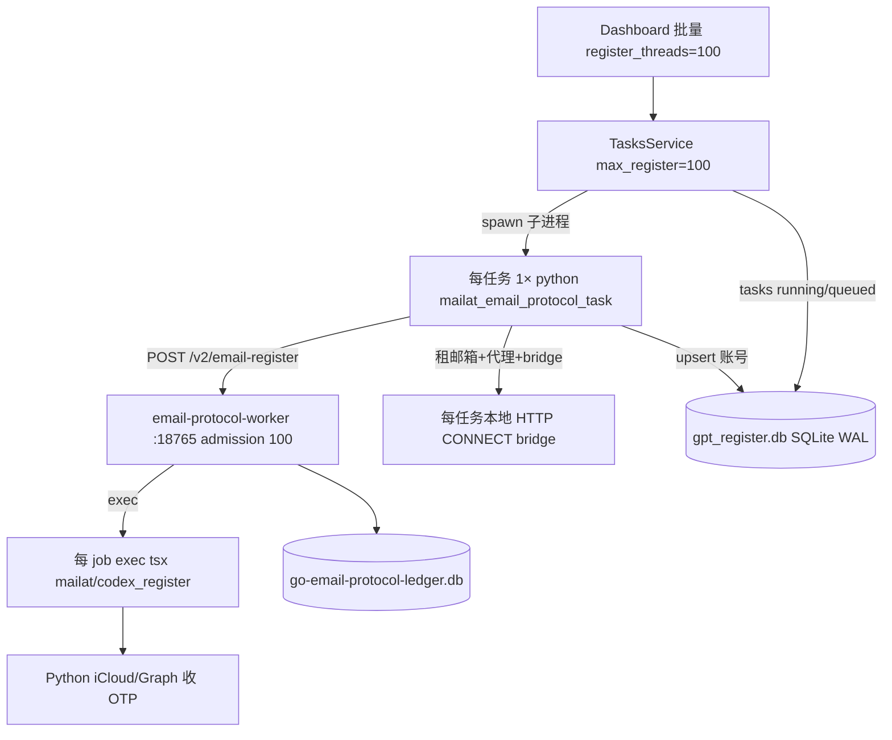
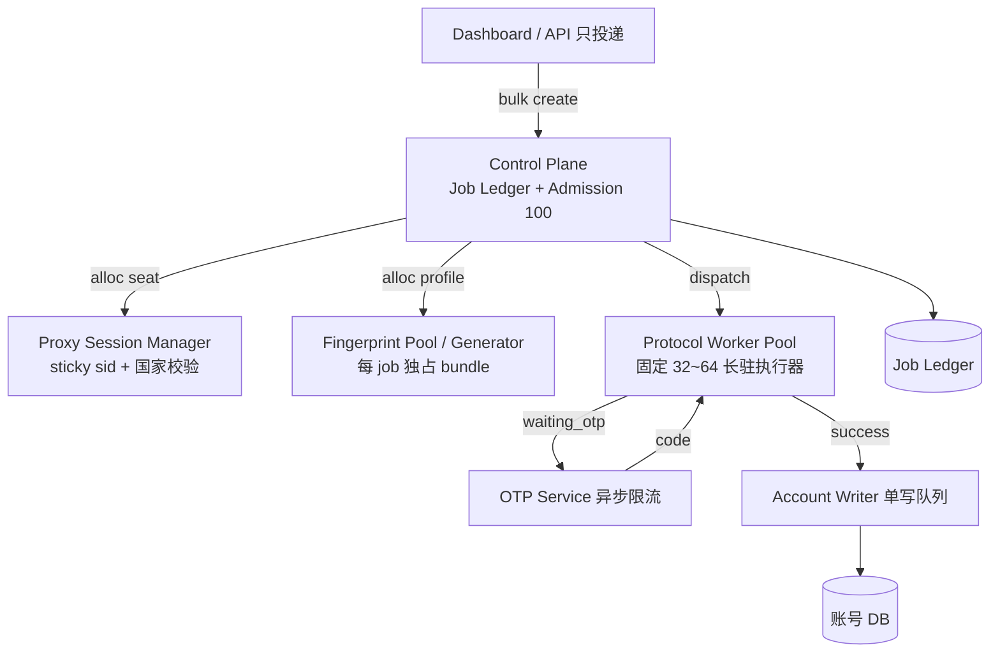

# 真·100 并发 + 指纹不串 + 动态 IP 修复总纲

> 状态：调研结论与实施清单（可勾选）  
> 范围：邮箱协议注册（`email-protocol-register-token` / Go `email-protocol-worker`）  
> 依据：源码 + 本机 2026-07-17 运行快照 + 只读子代理审计（非 STATUS/旧记忆）  
> 相关：`docs/EMAIL_PROTOCOL_GO_PLAN.md`（G0/G1 设计）、`docs/LAJIAO_CREDENTIAL_MODE.md`（代理）  
> 金标准：无指标、无自动化隔离测试，不得将 `max_register_tasks=100` 视为完成  
 
> **最新 HAR wire 合同：** `docs/LATEST_HAR_PROTOCOL_RECHALLENGE_PLAN.md` 专门负责 d17/d24 registration capture、Sentinel release、离线 replay、单会话 wire gate 与 promotion/rollback。本文仍只负责资源隔离、背压与 100 并发验收；R10 以前不得把并发绿灯当作协议正确性证据。

---

## 0. 目标与非目标

### 0.1 必须达成

| ID | 目标 | 一句话 |
|---|---|---|
| G1 | **真 100 并发** | 稳态同时存在约 100 个 **独立 sticky 出口 IP** 的 in-flight 注册会话，且 DB/进程/Go seat **三者一致** |
| G2 | **指纹不乱** | 任意两 job 的 UA/profile/TLS/cookie jar/proxy session **零交叉**；取消 A 不影响 B |
| G3 | **动态 IP** | 每 job（或每 attempt）独立 `sid_*` sticky；失败可 rotate；国家校验可开 |
| G4 | **可运维** | 无孤儿 running 占槽；满座=排队不是烧死；落库失败不把业务成功记成失败 |

### 0.2 明确非目标（本阶段不做）

- [ ] 多机水平扩展（先单机真 100）
- [ ] 把浏览器 Camoufox 路径也拉到 100（协议路径优先）
- [ ] 每 HTTP 请求换 IP（注册会话禁止）
- [ ] 用「加线程数」假装完成 G1

### 0.3 金标准（整体验收，全勾才算 Done）

- [ ] **AC-G1-1** 压测 100 并发 30 分钟：`tasks.status=running` 数 ≈ 活 Python/调度 inflight 数 ≈ Go `admission.ActiveCount()`，误差 ≤ 5%
- [ ] **AC-G1-2** 同时段唯一 `exit_ip` 数 ≥ 0.9 × active_jobs（动态 IP 生效）
- [ ] **AC-G1-3** 连续 30 分钟 **孤儿 running = 0**（DB=running 且无对应执行体）
- [ ] **AC-G2-1** 交叉污染探针：100 job 并行时 `profile_id` / `proxy_resource_key` / cookie jar / bridge 端口 **无串号**（自动化测试）
- [ ] **AC-G2-2** 取消 job_A 后 job_B 仍 running/waiting_otp，且 B 的 proxy/profile 不变
- [ ] **AC-G3-1** 同 attempt 全程同一 `sid`；retry attempt 必须新 `sid`（日志可证明）
- [ ] **AC-G4-1** 30 分钟压测 `database is locked` 导致的任务失败 = 0
- [ ] **AC-G4-2** Go `admission_rejected` / HTTP 429 **不**直接记业务 failed，而是 requeue（或可配置）
- [ ] **AC-G4-3** 成功注册但落库短暂失败时，有重试且最终账号入库，不丢号

---

## 1. 现状架构（As-Is）



### 1.1 关键代码锚点

| 环节 | 路径 / 符号 |
|---|---|
| 调度上限 100 | `application/tasks_service.py` `reload_limits` / `max_parallel` / `bucket_limits["register"]` |
| 出队 | `TasksService._drain_queue`（只扫 `status=queued`，claim 为 running） |
| 任务入口 | `services/mailat_email_protocol_task.py` → `run_go_email_protocol` / `run_mailat_email_protocol` |
| Go 客户端 | `services/go_email_protocol_runner.py` `run_go_email_protocol` / `_resource_grant` / `_bridge_parts` |
| Admission | `go-email-protocol/internal/admission` `DefaultMaxActive=100` `MaxPerProxy=1` `MaxPerMailbox=1` |
| 真执行 | `go-email-protocol/internal/job/mailat_runner.go` `runMailat` → `exec.CommandContext(tsx, …)` |
| Runtime 隔离字段 | `job.Runtime`：`JobID` `Profile` `Jar` `Client` `Proxy` `email` `password` `capability` |
| 指纹 schema（仅 stub） | `go-email-protocol/internal/fingerprint/bundle.go` `BundleV1` |
| request_fingerprint | Go create 校验；Python 侧对 email+proxy+bridge 做 sha256，**不是浏览器指纹包** |
| SQLite | `infrastructure/db.py` `connect`：WAL + busy_timeout=30000 + 每调用新连接 |
| 百并发测试 | `g1_test.go` `TestHundredIsolationAndBackpressure`（**synthetic**，不跑真 mailat） |

### 1.2 本机实测快照（问题证据）

| 现象 | 数量级 | 含义 |
|---|---|---|
| DB `running` email-protocol | ~100 | 调度认为满 |
| 活 `mailat_email_protocol_task` 进程 | ~9–11 | **假 100** |
| 孤儿 running | ~90 | 占槽，queued 出不来 |
| DB `queued` | ~300+ | 饿死 |
| `database is locked` 失败 | 多发 | 多进程写 SQLite |
| Go `admission_rejected` | 历史 40+ | 满座/互斥当失败烧掉 |
| iCloud OTP 超时 200s | 多发 | 外部收件瓶颈 |
| Go health | ok `0.2.0-mailat` | worker 活着，模型仍是 exec Node |

### 1.3 隔离保证 vs 缺口（源码级）

| 类别 | 内容 | 证据 |
|---|---|---|
| 有 | 全局 seat 上限 100；`MaxPerProxy=1` / `MaxPerMailbox=1` | `admission.DefaultMaxActive` / `TryAdmit` |
| 有 | per-job Runtime：Jar（`job_marker=JobID`）、ProxySnapshot、otpSignal | `job.Runtime` / `IsolationProbe` |
| 有 | mailat 工作目录 `WorkRoot/JobID`、独立 config/token | `runMailat` |
| 有 | OTP challenge 绑 job；错 challenge → 409 | `SubmitOTP` |
| 有 | 取消 A 不取消 B；第 101 active → 429 | `TestHundredIsolationAndBackpressure` |
| 无 | **真 TLS/浏览器指纹**：生产 `main` 注入 **`FakeFactory`** | `cmd/email-protocol-worker/main.go` |
| 无 | **FingerprintBundle 生成与注入**：仅 stub；Python 只传 `profile:{id}` | `fingerprint.BundleV1` |
| 无 | **动态 sticky sid 自动生成**：`credential_runtime` 无 sid 拼装 | `core/proxy/credential_runtime.py` |
| 无 | bridge capability 在 Python 本地桥强制校验 | Local bridge 任意 CONNECT |
| 弱 | `request_fingerprint` 是幂等哈希，不是设备指纹 | `run_go_email_protocol` |
| 弱 | OTP 等待仍占 Go seat + Python running 槽 | `waiting_for_otp` 不 Release |
| 弱 | 出队资源准备扇出仅 `max_workers≤8` | `_drain_queue` |
| 弱 | 百并发测试为 synthetic+FakeFactory | `g1_test.go` |

### 1.4 双账本 / 双天花板

| 层 | “在跑”记在哪 | 上限 |
|---|---|---|
| Python 调度 | `TasksService.running` + `tasks` 表 | `max_parallel` / `max_register_tasks`（1–100） |
| Go daemon | `admission.active` + ledger `jobs` | `DefaultMaxActive=100` |

二者不同步。`list_tasks` 对死 pid 可标 `interrupted`，**不会重新附着执行体**。

---

## 2. 根因分层（修复必须对层下药）

```text
L1 执行模型     每号 Python + 每号 Node + 每号 bridge     ← 最大自伤
L2 状态一致性   tasks 表 / self.running / Go ledger 三套账  ← 孤儿 running
L3 存储写路径   多进程写 SQLite 账号/任务                   ← database is locked
L4 指纹/会话    request_fingerprint ≠ 设备指纹；mailat 侧隔离弱
L5 动态 IP      sid sticky 有，但被进程模型拖死；缺统一 Session Manager
L6 外部资源     邮箱池 / OTP API / 代理商并发上限
L7 背压语义     429/满座 → failed 而非 requeue
```

**SQLite 有局限，但不是唯一瓶颈。** 先修 L1/L2，再修 L3/L4/L5。

---

## 3. 指纹「不乱」——定义与现状缺口

### 3.1 什么叫指纹不乱（本项目验收定义）

每个 in-flight job 必须 **私有**：

| 维度 | 必须 per-job | 现状 |
|---|---|---|
| 邮箱 `email_key` | 是（admission MaxPerMailbox=1） | ✅ 有 seat 互斥 |
| 代理 sticky `proxy_key` / `sid` | 是（MaxPerProxy=1） | ⚠️ key 对，执行成本高 |
| 本地 bridge URL/端口 | 是 | ⚠️ 每 job 新建，易泄漏端口/进程 |
| Cookie jar / session storage | 是 | ✅ Go Runtime 有 jar；真 mailat 靠进程隔离 |
| HTTP/TLS 客户端 | 是 | ⚠️ 真路径在 Node 子进程；Go Client 在 synthetic |
| **设备指纹包**（UA、sec-ch-ua、screen、tls profile…） | 是 | ❌ **仅 schema stub**；create 只带 `profile: {id}` |
| `request_fingerprint` | 幂等键，不是设备指纹 | ⚠️ 名称易误解：只绑 email+proxy+bridge |

### 3.2 串扰风险清单

- [ ] **R-FP-1** `profile` 未生成完整 FingerprintBundle，mailat 默认/环境指纹 → 多号同脸  
- [ ] **R-FP-2** **未自动生成 per-job `sid_*`**，多任务共用同一代理账号串 → 出口冲突  
- [ ] **R-FP-3** 生产 Go 注册路径 **FakeFactory**，真协议在 Node；Go TLS 测试对生产无约束  
- [ ] **R-FP-4** 空 `proxy_key` 跳过互斥 / 误共用 bridge → 路径串扰  
- [ ] **R-FP-5** 进程内线程池化后的全局 Session/环境变量污染  
- [ ] **R-FP-6** 取消时 Node 杀不干净  
- [ ] **R-FP-7** 把 `request_fingerprint` 误当成设备指纹验收

### 3.3 目标指纹隔离契约

```text
JobIsolationBundle {
  job_id
  profile_id
  fingerprint_bundle   // 完整设备画像，只读绑定到 job
  proxy_session_id     // sid_*
  proxy_upstream_url   // 含 sid 的 sticky URL
  bridge_id / generation / capability
  email_key
  cookie_jar_id        // = job_id
  tls_transport_id     // 与 bundle 一致，禁止跨 job 复用连接池
}
```

规则：

1. **创建时**生成并冻结 bundle（或从池中 **租用且独占** 一条画像）  
2. **运行中**禁止热更新 UA/时区/分辨率（与 TLS 不一致）  
3. **结束时**销毁 jar、关 bridge、还画像（若是池化）  
4. **日志**只打 `profile_id` hash，不打可复现整包（可选）

---

## 4. 真·100 并发目标架构（To-Be）



### 4.1 关键原则

| 原则 | 做法 |
|---|---|
| Inflight ≠ 进程数 | 100 inflight IO，**固定** worker 池执行 |
| 动态 IP = sticky session | 每 job 一个 `sid`，全程粘住；retry 换 sid |
| 指纹 = 独占资源 | 与 seat 同生命周期 |
| 单一状态真相 | Job ledger 为执行态 SSOT；账号库只收终态 |
| 背压可恢复 | 429/资源不足 → queued，不 failed |
| 写串行化 | 账号 upsert 单队列，消灭 lock 风暴 |

### 4.2 动态 IP（硬需求）落地

```text
alloc_proxy_session(country=JP):
  sid = random_digits(8)
  url = template(zone=JP, sid=sid, sticky_ttl=15..30m)
  optional preflight → exit_ip, country
  if country mismatch: retry alloc (≤3)
  return ProxySession{sid, url, exit_ip, job_id}

on_retry(job):
  release session
  job.session = alloc_proxy_session()  // 新 IP
```

- [ ] **禁止** per-request 轮转  
- [ ] **必须** per-job / per-attempt sticky  
- [ ] admission `proxy_key` = session 唯一键（完整 sticky URL 或 `sid+zone`）  

---

## 5. 分阶段修复清单（带复选框）

> 勾选规则：代码合入 + 对应「阶段验收」全绿 → 勾 phase Done。

---

### Phase 0 — 止血与基线观测（0.5–1 天）

**目的：** 先让系统可测、可跑，停止假 100 害人。

#### 任务

- [ ] **P0-1** 实现 **孤儿 running 回收**  
  - 条件：`tasks.status=running` 且（无 PID / PID 不存在 / 心跳超时）  
  - 动作：`interrupted` 或 `failed` + 事件 `stale_running_reaped` + `drain_queue`  
  - 位置建议：`TasksService.ensure_worker` 启动时 + 定时 10–30s  
- [ ] **P0-2** API/调度重启后 **从 DB reconcile** `self.running`（或明确：不信任内存 map）  
- [ ] **P0-3** 指标埋点（日志或 `/debug/concurrency`）：  
  - `db_running` / `db_queued` / `live_task_procs` / `go_active` / `orphan_running` / `unique_exit_ips`  
- [ ] **P0-4** 压测前默认并发降到 **24–32**（配置），文档注明「池化前禁止 100」  
- [ ] **P0-5** 失败分类仪表：`database is locked` / `admission_rejected` / `otp_timeout` / `mailat_exit` / `no_mailbox`
- [ ] **P0-6** 确认代理是否已含**不同 sid**；若无，P5-0 为阻断项（无 sid 不准宣称动态 IP）  
- [ ] **P0-7** 记录 drain 扇出=8 导致「配置 100 但启动波次慢」  

#### 阶段验收

- [ ] **AC-P0-1** 人为 kill 10 个任务进程后 ≤30s 内 orphan 清零，queued 开始出队  
- [ ] **AC-P0-2** 调试接口或日志能同时看到上表 6 个指标  
- [ ] **AC-P0-3** 连续 15 分钟 orphan_running 均值 = 0（并发 24）

---

### Phase 1 — 状态机与背压（1–2 天）

**目的：** 三套账收敛；满座可恢复。

#### 任务

- [ ] **P1-1** 定义执行态 SSOT = **Go ledger**（或扩展 tasks 表与 ledger 同步协议）  
  - Python tasks 仅作 UI 投影，终态以 ledger + 账号写入结果为准  
- [ ] **P1-2** Go `admission_rejected` / HTTP 429：  
  - Python 任务 → `queued`/`retry_wait` + backoff，**默认不 failed**  
  - 保留 `retryable=true`  
- [ ] **P1-3** 任务心跳：执行体每 N 秒写 `updated_at` 或 `result.pid`+heartbeat  
- [ ] **P1-4** 取消路径：保证 kill 进程树 + Release admission seat + ledger cancelled  
- [ ] **P1-5** 文档化状态图：`queued → admitted → running → waiting_otp → running → succeeded|failed`

#### 阶段验收

- [ ] **AC-P1-1** 填满 100 seat 后第 101 个：**排队/429 重试**，失败率不因满座上升  
- [ ] **AC-P1-2** 取消 10% 任务：active 下降，无 seat 泄漏（Go ActiveCount 对齐）  
- [ ] **AC-P1-3** 重启 API 后 1 分钟内状态自洽（无永久假 running）

---

### Phase 2 — 去掉「每号 Python 子进程」（2–4 天）

**目的：** 调度面从进程农场改为 **批量客户端 → Go**。

#### 任务

- [ ] **P2-1** 新批量路径：`TasksService` / 专用 `EmailProtocolScheduler`  
  - **不** `subprocess` 每号 `mailat_email_protocol_task`  
  - 线程/协程池（有界，如 32）调用 `run_go_email_protocol` 或更薄的 Go RPC 客户端  
- [ ] **P2-2** 资源租约（邮箱/代理）**延迟到即将 admitted 前**（避免 queued 占满 lease）  
- [ ] **P2-3** 保留旧子进程路径开关 `email_protocol_spawn_mode=process|inline` 直至稳定  
- [ ] **P2-4** UI/任务列表：running 定义改为「有 live 执行句柄或 ledger active」
- [ ] **P2-5** 出队后 lease/proxy precheck 扇出 **≥ 32**（今日 `_drain_queue` 仅 `min(8,n)`）  
- [ ] **P2-6** 任务 `result` 持久化 `go_job_id` + heartbeat；取消时调 Go Cancel API  

#### 阶段验收

- [ ] **AC-P2-1** 并发 64 时：`python -m services.mailat_email_protocol_task` 进程数 **≤ 2**（仅残留兼容）或 =0  
- [ ] **AC-P2-2** 同负载下内存较 process 模式下降 ≥ 40%  
- [ ] **AC-P2-3** 成功率不低于 process 模式基线（同邮箱池/代理）

---

### Phase 3 — Go 执行面：Worker 池 + 禁止 per-job exec（3–7 天）

**目的：** 真并发发生在 **长驻执行器**，不是 100 次 `exec tsx`。

#### 任务

- [ ] **P3-1** `mailat_runner` 改造方案二选一（文档决策后锁定）：  
  - **3A** Node **长驻 worker 池**（N=32~64），Go 通过 IPC/HTTP 派 job  
  - **3B** 协议逻辑迁入 Go（长期最优，工期更长）  
- [ ] **P3-2** 禁止默认路径 `exec.Command(tsx)` per job（可留 `MAILAT_EXEC_FALLBACK=1` 调试）  
- [ ] **P3-3** Worker 内 **禁止跨 job 复用**：HTTP client、cookie jar、页面状态  
- [ ] **P3-4** Bridge：  
  - 每 job sticky 上游 sid 仍唯一  
  - 本机 bridge **池化到 worker** 或 Go 直连上游 SOCKS，避免 100 本地端口  
- [ ] **P3-5** 扩展隔离测试：在 **非 synthetic** 或 mock mailat 下重复 100 隔离探针
- [ ] **P3-6** 生产 worker **禁止**长期仅靠 `FakeFactory` 充当注册执行（mailat 池或真 Transport，见 D1）  
- [ ] **P3-7** 收敛 mailat `cmd.Env`，避免无过滤 `os.Environ()`  

#### 阶段验收

- [ ] **AC-P3-1** 并发 100 时 Node 进程数 **≈ worker 池大小（如 32）**，不是 ≈100  
- [ ] **AC-P3-2** `TestHundredIsolationAndBackpressure` 仍绿，并新增 `TestMailatPoolIsolation`（cookie/proxy/profile）  
- [ ] **AC-P3-3** 连续 1h 无因 fd/port 耗尽导致的 `mailat_start_failed`

---

### Phase 4 — 指纹体系（与 Phase 3 可并行，2–5 天）

**目的：** 从 `profile:{id}` 升级到 **可验收的 FingerprintBundle 独占**。

#### 任务

- [ ] **P4-1** 实现 `FingerprintBundle` 生成器（字段对齐 `fingerprint.SchemaKeys` + 协议需要的 TLS/UA）  
- [ ] **P4-2** CreateJob 请求携带 **完整 bundle**（或 bundle_id + worker 本地取包）  
- [ ] **P4-3** mailat/Go 执行侧 **强制**使用 job 绑定 bundle，禁用默认全局 UA  
- [ ] **P4-4** 池化策略（可选）：预生成 N 条合法画像，租用/归还，避免运行时随机到非法组合  
- [ ] **P4-5** 串扰测试：并行 50 job，断言 jar/UA/proxy/profile_id 矩阵对角占优  
- [ ] **P4-6** 文档：`request_fingerprint` 与 `device_fingerprint` 命名拆分，防误用

#### 阶段验收

- [ ] **AC-P4-1** 任意成功 job 的产物/日志可追溯唯一 `profile_id`  
- [ ] **AC-P4-2** 自动化串扰测试 100% 通过（CI）  
- [ ] **AC-P4-3** 同 profile_id 不得同时绑定两个 active job  
- [ ] **AC-P4-4** 取消/失败后 bundle 租约释放（池耗尽测试）

---

### Phase 5 — 动态 IP Session Manager（1–3 天）

**目的：** 动态 IP 一等公民，可观测、可轮换。

#### 任务

- [ ] **P5-0（阻断）** lease 时生成唯一 `sid` + sticky `t`（LaJiao：`…-sid-{SID}-t-{MIN}…`），写入 `proxy_key`  
  - **无此条不得宣称 G3 / AC-G1-2 完成**  
- [ ] **P5-1** `ProxySessionManager.alloc/release/rotate`（country、sticky_ttl、sid）  
- [ ] **P5-2** 与 admission `proxy_key` 对齐  
- [ ] **P5-3** 可选 preflight（exit_ip + 国家）；失败 rotate ≤3  
- [ ] **P5-4** 指标：`unique_exit_ip` / `country_mismatch` / `sticky_reuse_violations`  
- [ ] **P5-5** 配置：`proxy_sticky_minutes` `proxy_preflight_enabled` `proxy_country`

#### 阶段验收

- [ ] **AC-P5-1** 100 active 时唯一 exit_ip ≥ 90  
- [ ] **AC-P5-2** 单 job 生命周期内 sid/exit_ip 不变（日志）  
- [ ] **AC-P5-3** 强制失败重试后 sid 变化率 = 100%  
- [ ] **AC-P5-4** 国家校验开启时，非 JP 不得进入协议主路径

---

### Phase 6 — OTP 异步与限流（1–3 天）

**目的：** OTP 不再堵死执行池。

#### 任务

- [ ] **P6-1** `waiting_for_otp` 时 **归还执行 worker**，只保留 admission seat（或独立 otp seat 预算）  
- [ ] **P6-2** OTP 收件全局并发上限（如 20）+ 每提供商限流  
- [ ] **P6-3** 超时策略：释放 seat / 标记 retryable，避免 200s×100 堆死  
- [ ] **P6-4** OTP 与 job 的 challenge_id / state_version 校验防串码

#### 阶段验收

- [ ] **AC-P6-1** 100 会话中 50 个等 OTP 时，执行 worker 占用 ≪ 50  
- [ ] **AC-P6-2** 验证码串号事故 = 0（challenge 绑定测试）  
- [ ] **AC-P6-3** OTP 超时任务不永久占满 register 槽

---

### Phase 7 — 存储与落库（1–3 天）

**目的：** SQLite 局限可控；业务成功不因锁丢失。

#### 任务

- [ ] **P7-1** 账号/任务 **单写队列**（或单 writer 线程）；业务线程只 enqueue  
- [ ] **P7-2** 热路径 **禁止** 重复 `init_db` 迁移；迁移仅启动一次  
- [ ] **P7-3** 连接池：长寿命连接 + WAL（已有 pragma 保留）  
- [ ] **P7-4** 落库失败自动重试（指数退避）；与「注册成功」解耦  
- [ ] **P7-5** （可选里程碑）任务态与账号态分库；或 Postgres 替换账号库  

#### 阶段验收

- [ ] **AC-P7-1** 并发 100 压测 30min：`database is locked` 任务失败 = 0  
- [ ] **AC-P7-2** 人为注入写延迟时，成功 token 最终 100% 入库（重试内）  
- [ ] **AC-P7-3** `init_db` 在稳态 QPS 下调用次数 ≈ 0

---

### Phase 8 — 资源容量与闸门（并行，1–2 天）

**目的：** 没有燃料不许开 100。

#### 任务

- [ ] **P8-1** 启动批量前检查：可用邮箱 ≥ min(requested, 100) + buffer（如 +20%）  
- [ ] **P8-2** 代理 sticky 可分配数检查  
- [ ] **P8-3** UI 显示：最大可开并发 = min(配置, 邮箱, 代理, OTP 预算)  
- [ ] **P8-4** 耗尽时快速失败 **在排队前**，避免 40 个「租邮箱失败」

#### 阶段验收

- [ ] **AC-P8-1** 邮箱=10 时无法启动 100 批量（明确错误）  
- [ ] **AC-P8-2** 资源耗尽错误可区分于协议失败

---

### Phase 9 — 压测与放量（持续）

#### 阶梯

- [ ] 16 并发 × 30min  
- [ ] 32 × 30min  
- [ ] 64 × 30min  
- [ ] 100 × 30min  
- [ ] 100 × 2h 浸泡  

#### 每级必采指标

| 指标 | 通过线（建议） |
|---|---|
| orphan_running | = 0 |
| db_running vs go_active 偏差 | ≤ 5% |
| unique_exit_ip / active | ≥ 0.9 |
| database is locked fails | = 0 |
| admission 误杀 failed | = 0（应 requeue） |
| OTP 串号 | = 0 |
| 指纹串扰测试 | pass |
| 成功/小时 | ≥ 基线（32 并发时的线性外推的 70% 可先接受，100 时再抬） |

---

## 6. 推荐实施顺序（依赖）

```text
P0 止血观测
 → P1 状态/背压
 → P2 去 Python 每号进程
 → P3 Worker 池（与 P4 指纹、P5 动态 IP 并行）
 → P6 OTP 异步
 → P7 写队列
 → P8 资源闸门
 → P9 放量 100
```

**不要**在 P2/P3 完成前把 `max_register_tasks` 拉回 100。

---

## 7. 指纹专项测试用例（须自动化）

- [ ] **T-FP-01** 100 并行 create：各 `profile_id` 唯一  
- [ ] **T-FP-02** Runtime probe：proxy_key / jar / profile 与 job_id 对齐（扩展现有 G1 测试）  
- [ ] **T-FP-03** 取消 job_i，job_j 的 cookie 与 proxy 不变  
- [ ] **T-FP-04** 同 task_id+attempt 不同 request_fingerprint → 409  
- [ ] **T-FP-05** 完整 bundle 缺失时 create 拒绝（fail closed）  
- [ ] **T-FP-06** worker 池模式下，连续 100 job 不共享 TLS session（若可测）  
- [ ] **T-FP-07** 日志红线：不得输出完整 refresh_token / 明文 capability  

`TestHundredIsolationAndBackpressure` **现状只证明**：synthetic 下 admission、runtime map、proxy/profile/jar 指针隔离与 101 背压。  
**不证明**：真 mailat、真指纹包、真代理出口、真 OTP、真 SQLite 落库。

---

## 8. 动态 IP 专项验收

- [ ] **T-IP-01** 100 active：`count(distinct exit_ip) ≥ 90`  
- [ ] **T-IP-02** 单 job 多阶段日志同一 sid  
- [ ] **T-IP-03** retry 后 sid 变化  
- [ ] **T-IP-04** 关闭 preflight 与开启 preflight 行为符合配置  
- [ ] **T-IP-05** 错误国家代理进不了 running 主路径  

---

## 9. 风险与决策记录

| 风险 | 影响 | 缓解 |
|---|---|---|
| 坚持 per-job Node | 永远假 100 | P3 必做 |
| 只调 SQLite pragma | 锁仍在高写爆 | P7 写队列 |
| 指纹只做 profile_id 字符串 | 风控侧「同脸」 | P4 完整 bundle |
| 邮箱/OTP 不够 | 100 空转失败 | P8 闸门 |
| 过早 UI 开放 100 | 回归灾难 | P9 阶梯放量 |
| 半迁移（Go+旧 Python 双路径） | 双倍债 | 开关限期删除旧路径 |

### 待产品/你拍板

- [ ] **D1** P3 选 3A Node 池 还是 3B 纯 Go 协议？  
- [ ] **D2** 账号库短期 SQLite 写队列 还是直接 Postgres？  
- [ ] **D3** OTP 超时后：释放 seat 重来 vs 延长 sticky 等待？  
- [ ] **D4** 指纹画像：运行时随机生成 vs 预生成池？  

---

## 10. 完成定义（Definition of Done）

全部满足：

- [ ] Phase 0–9 任务勾选完成（或明确 Won't Do 并写原因）  
- [ ] §0.3 金标准全绿  
- [ ] CI 含：隔离测试 + 背压测试 + 写路径单测  
- [ ] 运行手册：如何看 `orphan_running` / `unique_exit_ip` / 如何降级并发  
- [ ] 旧 `spawn per task` 默认关闭并在一个版本后删除  

---

## 11. 一句话

**真 100 = 100 个隔离的（指纹 × sticky IP × seat × jar）网络会话，由固定 worker 池执行；不是 100 个 Python/Node 进程。**  
本文件是验收合同：无勾选、无指标、不许把 `max_register_tasks=100` 当完成。

---

## 附录 A — 关键文件速查

```text
application/tasks_service.py          调度 / drain / 并发桶
services/mailat_email_protocol_task.py  任务进程入口
services/go_email_protocol_runner.py  Go 客户端 + grant
services/mailat_email_protocol_runner.py  Python mailat 路径
go-email-protocol/internal/admission/  100 seat
go-email-protocol/internal/job/       Runtime / mailat_runner
go-email-protocol/internal/fingerprint/ Bundle schema
go-email-protocol/internal/api/g1_test.go  百并发隔离测试
infrastructure/db.py                  SQLite WAL 连接
core/proxy/credential_runtime.py      代理 runtime / bridge
docs/EMAIL_PROTOCOL_GO_PLAN.md        原 Go 协议规划
docs/LAJIAO_CREDENTIAL_MODE.md        代理凭证
```

## 附录 B — 当前失败类型 → 归属 Phase

| 失败 | 归属 |
|---|---|
| orphan running / 队列饿死 | P0 P1 |
| database is locked | P7（辅 P2） |
| admission_rejected 变 failed | P1 |
| mailat_exit_error / 进程风暴 | P3 |
| OTP 超时潮 | P6 |
| 邮箱租不到 | P8 |
| 指纹同质/串扰 | P4 |
| 出口 IP 重复过多 | P5 |


## 附录 C — 子代理审计摘要

### C.1 Go 已保证

- seat 100；proxy/mailbox 互斥；Runtime/Jar/workdir 分 job  
- OTP challenge 隔离；取消不串；101 → 429  

### C.2 未保证（必须进 Phase）

- 真 TLS/设备指纹；Bundle 注入 mailat  
- sticky **sid 自动生成**（`credential_runtime` 现状无拼装逻辑）  
- bridge capability 强制  
- 生产非 FakeFactory 的注册传输  
- plus-verify 无 admission（勿与注册指标混用）  

### C.3 `TestHundredIsolationAndBackpressure` 边界

**证明：** 100 create、ActiveCount、proxy/profile/jar 探针、取消隔离、101 背压。  
**不证明：** 真 mailat、真代理、真指纹字段、MaxPerProxy 碰撞压测、SQLite 落库、邮箱 OTP 提供商。

### C.4 成功定义

> 真 100 = 100×(独占邮箱 × 独占 sticky sid/出口 × 独占指纹包 × 独占 jar) 的 in-flight 会话，由有界 worker 池执行；调度账本与执行账本一致；**不是** 100 个 OS 进程。