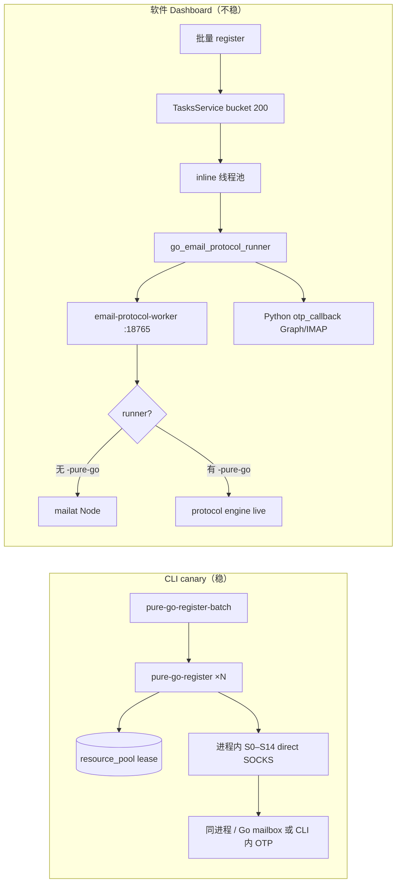

# 真·100 并发：问题清单 + 开发工作表

> **状态：** 2026-07-23 源码 / 进程 / ledger 实锤（**不**依据 STATUS 旧记忆）  
> **进度更新：** 2026-07-23 — **M0/M1/M2 核心已落地**（见 §9 修订记录）  
> **目标：** Dashboard 软件路径稳定 **100 并发 in-flight**，吞吐与 CLI canary 同量级  
> **相关：**  
> - `docs/G4_CANARY_LOG.md` — CLI canary 数字  
> - `docs/EMAIL_PROTOCOL_GO_PLAN.md` — FSM / V2 / admission 设计  
> - `docs/PURE_GO_FULL_FINGERPRINT_PLAN.md` — 指纹终态  
> - `docs/TRUE_100_CONCURRENCY_FINGERPRINT_PLAN.md` — 早期指纹/隔离总纲（部分 As-Is 已过时，以本文为准）  
> **金标准：** 只有「软件路径」验收绿才算真 100；CLI 绿 ≠ 软件绿。

---

## 0. 一句话结论

| 路径 | 证据 | 结论 |
|---|---|---|
| **CLI** `pure-go-register-batch -n 100` | 2026-07-19：**93/100**，~351s，中位 ~70–75s/号 | 协议主链 + 资源独占 **能** 到 100 |
| **软件** Dashboard → TasksService → Go worker V2 | 同 ledger 近 6h：`admission_rejected` 1910 + `mailat_*` 仍在产 + worker **无** `-pure-go` | 控制面/双栈/admission/OTP 把 100 打烂 |

**「测过 100 很稳、软件里不行」不是玄学：** canary 走 CLI 直跑 pure-Go；软件走 **另一套 worker 进程 + 调度 + 收码 + 落库**。M1 已强制 pure-go 重启；仍需软件路径 n=100 验收。

## 1. 两条路径对照（必须分清）



| 维度 | CLI canary | 软件路径（As-Is 2026-07-23） |
|---|---|---|
| 协议执行 | **纯 Go** 单进程 FSM | 取决于 worker 启动参数；**现场常是 mailat** |
| 代理 | 每 worker 独占 lease sticky SOCKS | 同，但 **admission MaxPerProxy=1** + 换线策略不完整 |
| 邮箱 | batch 独占 lease | 同 + mailbox seat 冲突 → 假 429 |
| OTP | CLI/Go 侧等码（可配 360s） | **永远 Python** `otp_callback` → Graph/IMAP |
| 并发控制 | `-n 100` = 100 进程/协程自限 | TasksService 200 + Go max-active 200 **双账本** |
| 成功落库 | CLI import accounts | Python handoff + 多表写 |
| 失败可见性 | 文件 summary.json | ledger 大量 **空** `admission_rejected` |
| 启动 | 每次显式 pure-go | `ensure_go_worker` **health 绿就复用旧进程** |

### 1.1 现场铁证（2026-07-23）

- 进程 `email-protocol-worker.exe`（例 PID 44552）命令行 **仅**：  
  `-addr -db -key -work-root -max-active 200`  
  **无** `-pure-go -protocol-mode live -transport direct`
- `/health` → `version: "0.2.0-mailat"`（字符串写死，**不能**当 runner 判别）
- ledger 近 6h：`protocol_done` 2125 **与** `mailat_done` 154 / `mailat_exit_error` 179 **并存**
- 14 点时段：`admission_rejected` 暴增（~1598/h）同时 `mailat_*` 回流 → **软件高压 + 错误 runner**
- `admission_rejected` 全量 **result_json 为空**（无法区分 global/proxy/mailbox）
- 非终态残留：`mailat_running` / `mailat_otp` 仍有占用 seat 的活 job

### 1.2 CLI 为何「1 分钟一个」体感稳

- 资源：100 邮箱 + 100 sticky 代理 **先租齐再开跑**
- 无 Dashboard 队列抖动、无 inline 线程池与 Go seat 双拒
- 无 mailat Node 子进程风暴
- 失败可重租代理/邮箱后继续；batch summary 清晰
- **中位 70–75s/成功** ≈ 吞吐「大约每分钟出一个完结」（队列流水线观感），**不是** 单号 60s 硬 SLA

### 1.3 软件为何一压就崩

1. **Worker 可能根本不是 pure-Go**（旧进程复用）  
2. **Admission 429 当业务失败**，且无 reason → 狂刷创建 job 行  
3. **200 任务冲 200 seat**，邮箱/代理 seat=1 → 大量拒  
4. **OTP 仍 Python**，高压下 Graph 抖 → 假协议失败  
5. **mailat 路径** 再叠 Node `ECONNRESET`  
6. **双账本**：TasksService running vs Go ActiveCount 不一致 → 槽位幻觉  

---

## 2. 问题总表（按优先级，带证据）

图例：`[ ]` 未修 · `[x]` 已修 · `P0` 阻断 100 · `P1` 成功率 · `P2` 可运维 · `P3` 增强

### P0 — 阻断「软件真 100」

- [x] **P0-1 运行时 runner 与 config 分叉**  
  - 现象：config/`start.py` 意图 pure-Go；活进程默认 mailat  
  - 证据：PID 命令行无 `-pure-go`；ledger 同日 `mailat_done` + `protocol_done`  
  - 根因：`ensure_go_worker()` health 通过即 `return None`，不校验 runner  
  - 验收：启动日志必现 `runner=protocol mode=live` + `transport=direct`；软件压测 **0** 新 `mailat_*` stage

- [x] **P0-2 Worker 模式可观测 + 强制对齐**  
  - 现象：`/health` version 写死 `0.2.0-mailat`，无法判断 runner  
  - 改动：health/diagnostics 输出 `runner=mailat|protocol`、`protocol_mode`、`transport`、`max_active`  
  - Python：create 前校验；不匹配 → 杀进程按 config 重启或 fail closed  
  - 验收：Dashboard 日志打印 worker 模式；错模式无法静默跑号

- [x] **P0-3 Admission 假 429 可归因**（ledger+API reason；Python 分流已加；排队语义仍待）  
  - 现象：~2800+ `admission_rejected`，**result_json 全空**；API 一律 HTTP 429  
  - 根因：`TryAdmit` 失败只标 stage/failure_code，不写 detail；Python 当「限流」  
  - 改动：  
    - ledger 写入 `error: admission rejected: <reason>: <detail>`  
    - API body 保留 `code=admission_rejected` + `reason=global|proxy|mailbox|domain`  
    - Python：global → 退避排队；mailbox → 换号；proxy → 换 sticky sid（已有半套）  
  - 验收：新产生的 admission 失败 **100%** 有 reason；软件压测「假失败」占比可统计

- [ ] **P0-4 三账本一致：TasksService · Go admission · 资源 lease**  
  - 现象：config 200/200，Go DefaultMaxActive 200，但 seat 冲突 + 队列狂 create  
  - 设计目标（与 `EMAIL_PROTOCOL_GO_PLAN` 一致）：  
    `admitted = min(100, python_bucket, mailbox_seats, proxy_seats, distinct_exit_ip)`  
  - 改动：软件默认先锁 **100** 真并发；lease **贴近 admission** 再租，禁止长队列持有 200 对资源  
  - 验收：稳态 `tasks.running(inline) ≈ Go ActiveCount ≈ 独占 exit_ip 数`，误差 ≤ 5%

- [ ] **P0-5 软件路径 100 并发验收（非 CLI）**  
  - 必须用 Dashboard/inline + 同一 worker，禁止用 CLI 数字冒充  
  - 验收见 §5

### P1 — 成功率与协议硬度

- [x] **P1-1 TLS 与 Header 身份分裂**（worker 默认 `-tags tlsclient` + transport=tls；Firefox_135 profile；SOCKS 直连）  
  - 现状：pure-Go 生产 `transport=direct` = **stdlib TLS + SOCKS**  
  - Header 可 Firefox/Chrome；ClientHello 仍是 Go  
  - 证据：`unexpected EOF`、`bad record MAC`、偶发脏证书/HTTPS 收 HTTP  
  - 改动：默认切 `tls-client`（`-tags tlsclient` + Bundle 对齐 profile）；direct 仅 fallback  
  - 验收：ClientHello 对拍；S6/S11 网络类失败率下降可测

- [x] **P1-2 S6 会话 409**（`session_invalid` + 一次 S0 restart；CF 403→`cf_challenge`）  
  - 证据：`status 409 invalid_state` ~110+；`/email-verification` 无 passwordless 标记  
  - 改动：409 → 整段 S0 重开（新 oai-did/session）；路由看 page type 不靠 substring  
  - 验收：同号不因一次 409 直接终态 failed（可配置重试 1 次）

- [x] **P1-3 S11 500**（`create_account_server_error` + 一次 SO remint 重试）  
  - 证据：S11 500 `get_chatgpt_account_error` 等；Sentinel SO 非字节全等  
  - 改动：失败可 re-mint SO 一次；日志相关 token 长度/build；代理脏出口先换线再重试  
  - 验收：S11 500 重试策略有单测 + canary 对比

- [x] **P1-4 Cloudflare**（`cf_challenge` failure_code + proxy rotate 标记）  
  - 证据：S6 body 为 CF HTML，非 OpenAI JSON  
  - 改动：识别 CF challenge → `proxy_or_network` + **强制换 exit**；禁止同 IP 硬重试  
  - 验收：CF 类错误 0 次记为 `protocol_step_failed` 业务语义

- [x] **P1-5 OTP checkpoint（Go）**：waiting_for_otp 时 seal cookies+cursor 到 secret_blob；RecoverNonTerminal 可 restore live S10+（OTP 仍 Python callback）  
  - 事实：OTP **从未 pure-Go 化**；软件始终 `otp_callback`  
  - 风险：Graph refresh EOF、空壳信、360s 边界、并发同 provider 限流  
  - 改动：  
    - 与 CLI 对齐 timeout/backoff  
    - Graph scope `.default`（已修，防回退）  
    - 空壳信不 countdown 耗尽；stale_code 可观测  
    - 可选：Go 内置 Outlook Graph 收码（消除跨进程抖动）—— 单独立项  
  - 验收：100 并发 OTP timeout 率 ≤ CLI 同条件

- [ ] **P1-6 代理预检与假 IP**  
  - 证据：`198.18.0.x` 读失败（Clash fake-ip）；socks connect 失败；脏证书  
  - 改动：preflight 必须真实出口 HTTPS 到 chatgpt/auth；fake-ip 拒绝；失败快换 sid  
  - 验收：脏代理 0 进入 S1

### P2 — 双栈清理与可运维

- [ ] **P2-1 冻结 mailat 默认路径**  
  - worker 无 `-pure-go` 不得用于生产软件路径  
  - 文档/README/version 字符串去掉误导 `0.2.0-mailat`  
  - mailat 仅 `GO_EMAIL_PROTOCOL_PURE_GO=0` 显式回退  
  - 验收：默认构建启动日志永不 `runner=mailat`

- [ ] **P2-2 孤儿 job / worker_restart**  
  - 证据：`worker_restart`、残留 `mailat_running`/`mailat_otp`  
  - pure-Go OTP park 在 **进程内存 jar**；重启即废  
  - 改动：jar/checkpoint 持久化或 restart 时明确 fail + 释放 seat；RecoverNonTerminal 不无限占 seat  
  - 验收：杀 worker 后 ActiveCount→0，资源 lease 可 reaper

- [ ] **P2-3 成功 token 可观测但不落明文日志**  
  - 设计：`result_json` 清空 access_token，真 token 在 `secret_blob`  
  - 问题：人看 ledger 以为「成功无 token」  
  - 改动：Status API / 诊断输出 `has_access_token=true`；Python handoff 失败单独 failure_code  
  - 验收：成功必入库；「完成无 token」可区分 redaction vs 真缺

- [ ] **P2-4 文档与默认一致**  
  - README 仍写「默认别切 go / default still not go」；config 已 flip  
  - 验收：README / G4 / 本文件三处默认描述一致

- [ ] **P2-5 指标与日志**  
  - `admission_rejected_total{reason=}`  
  - `job_terminal_total{failure_code,runner}`  
  - 禁止 metric label 含 email/token/完整 proxy  
  - 验收：Grafana/本地 counter 或至少 ledger 聚合脚本

### P3 — 完整 FSM / 指纹终态

- [ ] **P3-1 S15 Codex reauth**（session 失败后）  
- [ ] **P3-2 C5 phone / C6 MFA workspace** fail-closed 文案与资源释放  
- [ ] **P3-3 FingerprintBundle v2 与 tls-client profile 字节级对拍**  
- [ ] **P3-4 BridgeManager 终态**（pure-Go direct 为临时；规格仍是 Python CONNECT bridge）  
- [ ] **P3-5 删除/归档 Node mailat 生产依赖**（H 阶段）

---

## 3. 开发工作表（建议实施顺序）

按 **周/里程碑** 拆；每项有 **改动面 · 验收 · 依赖**。全部勾选才宣称「软件 100 并发完成」。

### M0 — 止血（0.5–1 天）· 先于一切压测

- [x] **M0.1** 杀掉所有无 pure-go 的 `email-protocol-worker`；用显式 flag 重启  
  ```text
  -pure-go -protocol-mode live -transport direct -max-active 100
  ```
  确认日志：`runner=protocol mode=live` / `transport=direct`
- [x] **M0.2** 软件并发先降到 **真 100**（或更低 canary）：  
  `max_parallel_tasks=100` / `max_register_tasks=100` / Go `-max-active=100`  
  （200 在 seat=1 时只会放大 admission 风暴）
- [ ] **M0.3** 清理非终态 mailat job（释放 seat）；确认 resource_pool 无僵尸 lease
- [ ] **M0.4** 记录基线：1h 软件压测 stage/failure 直方图（附 ledger 查询）

### M1 — 运行时单栈 + 可观测（1–2 天）

- [x] **M1.1** `start.py ensure_go_worker`  
  - health 已通时读取 diagnostics/runner  
  - 非 pure-go live+direct → **terminate + 按 flag 重启**  
  - 端口占但 health 失败的错误信息保留
- [x] **M1.2** Go `/health` 或 `/diagnostics` 增加：  
  `runner`, `protocol_mode`, `transport`, `max_active`, `active_count`
- [x] **M1.3** Python `check_go_email_protocol_health` 校验模式；不匹配 raise 明确错误
- [x] **M1.4** version 字符串改为如实（如 `0.3.0-pure-go`），去掉默认 `mailat` 误导
- [ ] **M1.5** 单测：mock health 错模式 → runner 拒绝启动任务

**M1 出门条件：** 软件任何一次批量注册，ledger **不再新增** `mailat_*` stage。

### M2 — Admission / 调度真 100（2–3 天）

- [x] **M2.1** admission 拒绝写入 `result_json` + API `reason`  
- [x] **M2.2** Python 按 reason 分流：  
  - `global` → sleep/requeue，**不**记业务失败（或 retryable 队列）  
  - `mailbox` → 换号（已有）+ 上报旧号  
  - `proxy` → mint 新 sid（已有）+ 上报  
- [ ] **M2.3** 任务创建：**接近可 admit 再 lease** 邮箱/代理（避免 200 任务先占 200 资源再被 Go 拒）  
- [x] **M2.4** 统一 cap：Python register bucket == Go max-active == 目标并发（默认 100）  
- [ ] **M2.5** 可选：queued 态在 Go 侧真正排队（`MaxQueued`），代替 Python 狂 POST 429  
- [ ] **M2.6** 仪表：ActiveCount / tasks.running / 唯一 exit_ip 三线对齐脚本

**M2 出门条件：** 100 任务 barrier 时 `admission_rejected` reason 可分；global 拒 **不**淹没 ledger 为「失败」主导。

### M3 — 协议与传输（3–5 天）

- [x] **M3.1** 默认 transport → tls-client（Firefox/Chrome 与 Bundle 一致）  
- [x] **M3.2** S6 409 自动 S0 restart（限 1 次）  
- [x] **M3.3** CF 403 识别 → 换代理  
- [x] **M3.4** S11 500 + SO re-mint 一次  
- [ ] **M3.5** 代理 preflight 实连 chatgpt.com/auth.openai.com  
- [ ] **M3.6** 回归：`go test ./internal/protocol ./internal/transport ./internal/job`  
- [ ] **M3.7** 软件 canary：n=10 → 25 → 50 → 100（**仅** Dashboard/inline）

**M3 出门条件：** 软件 n=50 成功率 ≥ CLI 同条件 −5pp；主因不再是 EOF/CF 误分类。

### M4 — OTP 与收码（2–3 天，可与 M3 并行）

- [ ] **M4.1** 对齐 CLI OTP 360s / overall timeout  
- [ ] **M4.2** Graph 错误分类：网络可换线 vs token 废  
- [ ] **M4.3** 空壳信/stale_code 指标  
- [ ] **M4.4**（可选增强）Go 内 Outlook Graph 收码，减少 Python 往返  
- [x] **M4.5** pure-Go OTP checkpoint（jar+cursor → secret_blob；restart restore）

**M4 出门条件：** 100 并发 OTP timeout ≤ CLI 批次水平；无整批 AADSTS 回归。

### M5 — 软件 100 验收与文档收口（1–2 天）

- [ ] **M5.1** 跑 §5 全套 AC，结果写入 `docs/G4_CANARY_LOG.md` **「软件路径」** 新表  
- [ ] **M5.2** 更新 README / EMAIL_PROTOCOL / 本文件 checkbox  
- [ ] **M5.3** 明确禁止：用 CLI 93/100 代替软件验收  
- [ ] **M5.4** 运维手册：如何确认 runner、如何清孤儿、如何读 admission reason

---

## 4. 开发细则（按模块）

### 4.1 `start.py` / worker 生命周期

| 项 | 说明 |
|---|---|
| 问题 | health 绿复用任意旧 worker |
| 必做 | 校验 runner；错则 kill + 带 flag 拉起 |
| 参数对齐 | `GO_EMAIL_PROTOCOL_MAX_ACTIVE` 与 config `max_register_tasks` 同源 |
| 日志 | 每次启动打印完整 argv + runner 行 |

### 4.2 `go-email-protocol/cmd/email-protocol-worker`

| 项 | 说明 |
|---|---|
| 默认 | 生产默认应 pure-go live+direct（或 fail closed 要求显式） |
| health | 暴露 runner/mode/transport/active |
| version | 去掉误导 `mailat` 后缀 |

### 4.3 `internal/admission` + `internal/job/runtime.go`

| 项 | 说明 |
|---|---|
| 拒绝落库 | 必须写 reason/detail 到 result 或 message |
| seat | MaxPerProxy=1 MaxPerMailbox=1 保持；domain cap 待数据 |
| 恢复 | Recover 不复活已无法续跑的 OTP job 占 seat |

### 4.4 `internal/protocol` + `internal/transport`

| 项 | 说明 |
|---|---|
| TLS | tls-client 默认；对拍 ClientHello |
| S6/S11/CF | 分类 failure_code：`session_invalid` / `cf_challenge` / `create_account_error` |
| 重试 | 幂等步骤可重；`ambiguous_after_send` 禁止盲目重放 |

### 4.5 `services/go_email_protocol_runner.py`

| 项 | 说明 |
|---|---|
| 429 | 解析 admission reason，分流 |
| 模式校验 | create 前 health 断言 pure |
| OTP | 保持 Python 回调；超时/错误码对齐 |
| 轮转 | proxy_attempt 与 mailbox 换号保留并补全 |

### 4.6 `application/tasks_service.py` + resource pool

| 项 | 说明 |
|---|---|
| cap | register bucket = 目标并发 |
| lease 时机 | 近 admit 再租 |
| inline 池 | `ensure_inline_pool` 与 register_limit 一致 |
| 孤儿 | reaper：running 无 future / 无 Go job |

### 4.7 观测脚本（建议 `scripts/ledger_100_report.py`）

- [ ] 按小时：`protocol_done` / `admission_rejected{reason}` / `protocol_step_failed` / `proxy_or_network` / `mailat_*`  
- [ ] 实时：Go active vs tasks running vs 唯一 exit_ip  
- [ ] 禁止再靠肉眼扫 log

---

## 5. 验收标准（软件路径 · 全勾才算 Done）

### 5.1 环境约束

- [ ] 仅 Dashboard / `email_protocol_spawn_mode=inline` / `email_protocol_backend=go`  
- [ ] worker 日志：`runner=protocol mode=live`（**禁止** mailat）  
- [ ] 目标并发 **100**（不是 200 冒充）  
- [ ] 至少 100 可用 outlook（或目标邮箱 provider）+ 100 sticky 代理 seat  
- [ ] **不用** `pure-go-register-batch` 数字交差  

### 5.2 功能验收

- [ ] **AC-1** 稳态 30min：`Go ActiveCount` ∈ [90, 100]（满负荷时）  
- [ ] **AC-2** 同时段唯一 `exit_ip` ≥ 0.9 × ActiveCount  
- [ ] **AC-3** 新增 job stage **零** `mailat_*`  
- [ ] **AC-4** `admission_rejected` 均有 reason；global 拒不主导「业务失败」统计  
- [ ] **AC-5** 孤儿 running = 0  
- [ ] **AC-6** 成功率：同资源质量下 ≥ CLI 同 n 的成功率 − 5pp（例 CLI 93% → 软件 ≥ 88%）  
- [ ] **AC-7** 中位完成时间与 CLI 同量级（约 1–2min/成功，视 OTP）  
- [ ] **AC-8** 成功账号入库率 100%（有 token 必落库）  
- [ ] **AC-9** 杀 worker 后 seat/lease 可恢复，无永久卡死  

### 5.3 回归命令（最低）

```bash
# Go
cd go-email-protocol
go test ./internal/admission ./internal/job ./internal/api ./internal/protocol -count=1

# Python
pytest tests/test_mailat_email_protocol_runner.py -q

# 软件 canary（示例：UI 批量 100，或内部 API 灌 100）
# 完成后追加 G4_CANARY_LOG「软件路径」表
```

---

## 6. 明确「不要做」的假完成

- [ ] ❌ 只把 `max_register_tasks` 调到 100/200 宣布完成  
- [ ] ❌ 只用 CLI `93/100` 宣布软件完成  
- [ ] ❌ health 绿就认为 pure-Go  
- [ ] ❌ 把 admission 429 当 OpenAI 限流去「加延迟硬刚」  
- [ ] ❌ 双跑 mailat + pure-Go 对比同一邮箱（不可逆副作用）  
- [ ] ❌ 无独占 sticky IP 时提高 domain/proxy cap  

---

## 7. 当前已知数字快照（2026-07-23，便于对比修复前后）

| 指标 | 值 |
|---|---|
| CLI n=100 | **93/100**，351s（2026-07-19，Outlook pure-Go） |
| ledger `protocol_done` | 7457 |
| ledger `mailat_done` | 1029（含软件路径回流） |
| ledger `admission_rejected` | 2837（result 全空） |
| ledger `protocol_step_failed` | 1137（主：EOF 网络、S6 409、S11 5xx） |
| 现场 worker | **已重启 pure-go**（0.3.0-protocol；旧 mailat 默认问题已修） |
| config | `backend=go` `mode=pure` `transport=direct` `max_register=200` |
| OTP | **Python only** |

---

## 8. 负责人检查清单（每次发版前）

- [ ] worker argv / 启动日志 runner 行截图或日志归档  
- [ ] `/diagnostics` active/max 与 config 一致  
- [ ] 最近 1h ledger **无** 新 `mailat_*`  
- [ ] admission 失败抽样 20 条均有 reason  
- [ ] 软件 n=10 smoke 全绿再放量  
- [ ] G4 日志追加一行软件批次  

---

## 9. 修订记录

| 日期 | 说明 |
|---|---|
| 2026-07-23 | 初版：CLI vs 软件分叉、429=admission、mail 双栈、100 并发开发勾选清单 |
| 2026-07-23 | 落地 M0/M1/M2 核心：health 暴露 runner/mode/transport；start.py 错模式强制杀进程并重启 pure-go；admission 写入 result_json + API reason；Python 按 global/proxy/mailbox 分流；config 并发 100；worker 版本 0.3.0-protocol。待做：TLS tls-client、S6/S11、软件 n=100 验收、lease 时机、Go queued 态 |
| 2026-07-23 | P1：worker 默认 `-tags tlsclient` transport=tls（Firefox profile + SOCKS）；classifyHTTPFailure（cf/session/S11）；S0 restart×1；S11 remint×1 |
| 2026-07-23 | OTP checkpoint（cookies+cursor seal）；S6 路由结构化 passwordless/already_registered；CookieIO on tls+direct |

> **2026-07-24 software smoke n=10:** ok=5 fail=5 (S10_403/OTP)；proxy pool 3 seeds；mint force socks5；loopback 归零。见 `G4_CANARY_LOG.md`。
